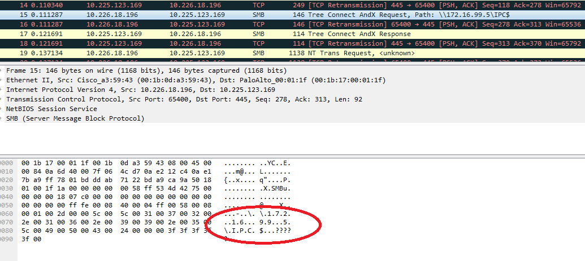
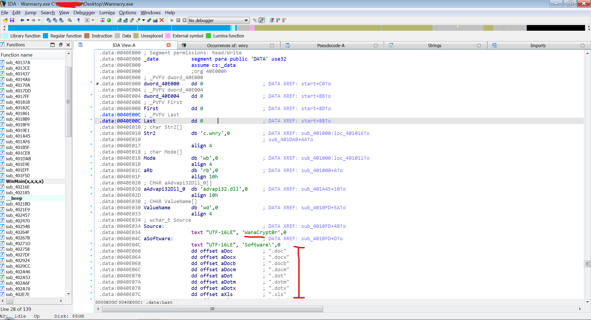
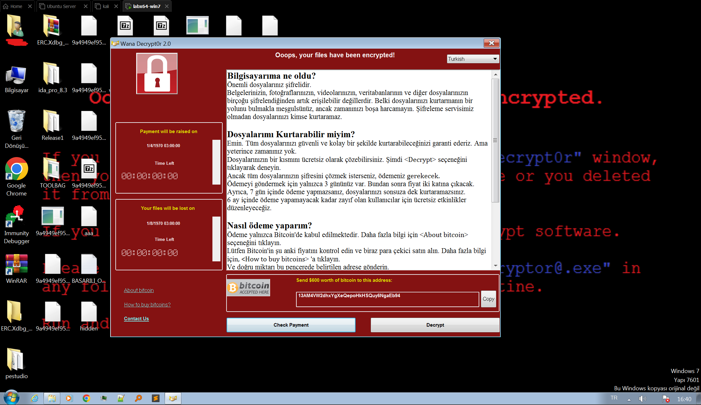

# Vaka Çalışması: WannaCry Saldırısı ve SMBv1 Zafiyetinin Derinlemesine Analizi

---

## Müşteri Profili

**Sektör**: Sağlık Sektörü
**Kuruluş Büyüklüğü**: 5.000+ çalışan, Coğrafi Olarak Dağıtılmış Çok Hastaneli Ağ
**Ortam**: Kuruluşun altyapısı, katı uyumluluk kuralları ve eski yazılım bağımlılıkları nedeniyle büyük ölçüde eski Windows sistemlerine (Win 7/XP) ve yama yapılmamış sunuculara dayanmaktadır. Bu sistemler, MR cihazları ve hasta monitörleri dahil olmak üzere kritik tıbbi ekipmanları yönetmektedir. Ağ mimarisi genel olarak düzdür (flat network) ve kritik tıbbi cihazlar ile idari iş istasyonları arasında uygun bir ağ bölümleme (segmentasyon) bulunmamaktadır.

---

## Sorun

Müşteri, bir cuma öğleden sonra tüm hastane ağındaki bilgisayarların aniden kilitlendiği kritik bir olay bildirdi. Ekranlarda tehditkar kırmızı bir fidye notu ("Oops, your files have been encrypted!" - "Hata, dosyalarınız şifrelendi!") belirdi ve dosyaların şifresini çözmek için ödeme talep edildi. Acil servis hizmetleri anında durdu, radyoloji görüntüleme sistemleri kullanılamaz hale geldi ve hayati hasta kayıtlarına erişim tamamen kesildi.

**Hızlı Yayılım**: Enfeksiyon, ele geçirilmiş tek bir makineden başladı ve VPN tünelleri aracılığıyla insan müdahalesi olmadan yatayda hareket etmek için solucan (worm) benzeri yeteneklerden yararlanarak dakikalar içinde tüm ağa ve şubelere yayıldı.
**Kritik Sistemler**: Saldırı yalnızca idari BT sistemlerini değil, aynı zamanda Windows tabanlı gömülü sistemleri de yıktı geçti. MR makineleri ve hasta izleme üniteleri gibi kritik hasta bakım cihazları çalışamaz hale geldi.
**Kritik Soru**: CISO'nun acilen yanıtlaması gereken soru şuydu: "Bu solucan ağımızda nasıl bu kadar hızlı yayılıyor ve her makinenin fiziksel bağlantısını kesmeden ve kritik bakımı aksatmadan onu derhal durdurmak için ne yapabiliriz?"

---

## Çalışma Kapsamı

**Başlangıç Durumu**: İlk salgın sırasında elde edilen, enfekte olmuş ve izole edilmiş bir Windows 7 terminali ile ağ trafiği günlükleri (PCAP), adli analiz için teslim alındı.
**Hedef**: Kötü amaçlı yazılımın yayılma mekanizmasını (solucan davranışı) derinlemesine analiz etmek ve tersine mühendislik yoluyla olası zayıflıkları veya anında durdurma mekanizmasını (durdurma anahtarı / killswitch) belirlemek.
**Kısıt**: Kritik sağlık hizmetlerinin sürekliliğini sağlamak için müdahale, sistem kesinti süresini en aza indirmelidir; bu da tam bir ağ kapatmasının geçerli bir seçenek olmadığı anlamına gelir.

---

## Düşman Taktikleri ve Teknik Analiz

Kurtarılan dosyanın tersine mühendisliği, tespit edilmeden önce kalıcılık ve maksimum yayılım sağlamak için tasarlanmış sofistike çok aşamalı bir yürütme modeli ortaya çıkardı.

### 1. Kalıcılık ve Servis Oluşturma
Zararlı yazılım çalıştırıldığında, kendini meşru bir sistem süreci gibi gizlemek için `mssecsvc2.0` (Microsoft Security Center (2.0) Service) adlı bir hizmet (service) olarak yükler. Bu hizmet otomatik olarak başlayacak şekilde yapılandırılmıştır ve yeniden başlatmanın ardından bile çalışmasını sağlar.

- **Bırakılan Dosya (Dropped File)**: `C:\WINDOWS\tasksche.exe` (Şifreleyici yük - encryptor payload)
- **Hizmet Adı**: `mssecsvc2.0` (Solucan yayıcısı)
- **Mutex**: `Global\MsWinZonesCacheCounterMutexA` (Aynı ana bilgisayarda birden fazla enfeksiyonu önlemek için kullanılır)

### 2. Antivirüs Atlatma ve Zafiyet Sömürme Teknikleri
Zararlı yazılım, kuruluşun eski antivirüs çözümlerini birkaç teknikle atlattı:
- **Güvenilir Protokol İstismarı**: Dosya paylaşımı için gerekli olan ve dahili güvenlik duvarlarında beyaz listede bulunan SMB (Server Message Block) protokolünden yararlandı.
- **Bellek İçi Enjeksiyon (In-Memory Injection)**: EternalBlue açığı sömürüsü, shellcode'u doğrudan çekirdeğin diske yazılmayan (non-paged) havuz belleğine enjekte ederek, AV'nin taraması için diske herhangi bir dosya bırakmadan doğrudan SYSTEM ayrıcalıklarıyla çalıştırır.
- **Hizmet Gizleme (Masquerading)**: Hizmeti `mssecsvc2.0` olarak adlandırmak, yalnızca belirgin derecede şüpheli isimleri arayan temel izleme araçlarını kandırdı.

### 3. Yanal Hareket Mekanizması
Solucan modülü iki farklı tarama iş parçacığı içerir:
- **Yerel Ağ**: Enfekte olmuş makinenin alt ağ maskesini hesaplar ve aralıktaki (örn. `192.168.1.x`) her özel IP'yi açık 445 Numaralı Bağlantı Noktası için tarar.
- **Genel İnternet**: Küresel çapta yayılmak için rastgele genel IP adresleri üretir.

---

## Temel Bulgular

### Bulgu 1: EternalBlue İstismarı (MS17-010) ve SMBv1

Ayrıntılı ağ trafiği (Wireshark) ve bellek analizi, kötü amaçlı yazılımın 445 (SMB) portu üzerinden agresif bir şekilde yayıldığını ortaya koydu. Kötü amaçlı yazılım, NSA tarafından sızdırılan ve silah haline getirilmiş bir araç olan **EternalBlue** sömürüsünü kullanarak hedef sistemlerdeki SMBv1 hizmetinde belirli bir arabellek aşımı (buffer overflow) güvenlik açığını tetikledi. Bu, saldırganların SYSTEM ayrıcalıklarıyla yetkisiz Uzaktan Kod Yürütme (RCE) elde etmesine olanak sağladı.

**Güvenlik Açığı**: Windows SMBv1 Uzaktan Kod Yürütme (CVE-2017-0144).
**Sömürü**: Özel olarak hazırlanmış, hatalı biçimlendirilmiş SMB paketleri aracılığıyla hedefin çekirdek havuzunun (kernel pool) bozulması.
**Etki**: Ağdaki yama yapılmamış tüm Windows sistemlerinin herhangi bir kullanıcı etkileşimi olmaksızın hızlı ve otomatik bir şekilde ele geçirilmesi.
**Tespit Durumu**: Mevcut IPS sistemleri, bu özel sömürü için güncel imzaların eksikliği nedeniyle saldırıyı tespit edip engelleyemedi.

### Bulgu 2: Durdurma Anahtarı (The Killswitch)

Statik analiz (IDA Pro) sırasında, kötü amaçlı yazılımın potansiyel olarak yıkıcı eylemleri başlamadan önce tuhaf ve beklenmedik bir HTTP isteği gözlemlendi. Kodun çalışmasının en başında `http://www[.]iuqerfsodp9ifjaposdfjhgosurijfaewrwergwea[.]com` adresine bağlanmaya çalışıyordu. Mantık basit bir kontrolü ortaya çıkardı: Eğer bu adrese başarıyla bağlanabilirse (yani alan adı kaydedilmiş ve aktifse), zararlı yazılım bir sandbox'ta olduğunu varsayarak kendini sonlandıracaktı (Exit). Eğer bağlanamazsa, dosyaları şifrelemeye ve yayılmaya devam edecekti.

**Güvenlik Açığı**: Yazarların analizden kaçmak için Sandbox Karşıtı (Anti-Sandbox) bir teknik olarak amaçladıkları basit bir mantık hatası.
**Sömürü**: Kayıtsız olan bu alan adının tescil edilmesi (DNS Sinkhole).
**Etki**: Dünyanın dört bir yanındaki örneklerin bu alan adına bağlanıp kapanmasıyla kötü amaçlı yazılımın küresel yayılımının anında durması.
**Tespit Durumu**: HTTP GET isteği proxy günlüklerinde gözlemlendi, ancak o sırada tehdit istihbaratı (threat intelligence) kaynakları tarafından kötü amaçlı olarak işaretlenmedi.

### Bulgu 3: WanaDecrypt0r Şifrelemesi

Zararlı yazılım, kullanıcı dosyalarını şifrelemek için AES-128 (CBC modu) kullanarak her dosya için benzersiz ve rastgele bir anahtar üretti. Bu anahtarlar daha sonra kodun içine gömülü (hardcoded) bir RSA-2048 genel anahtarıyla (public key) şifrelendi ve dosya başlığına eklendi.

Geri sayım sayacını ve ödeme talimatlarını gösteren kullanıcı arayüzü `tasksche.exe` üzerinden çalışıyordu.

**Güvenlik Açığı**: Güçlü ve doğru uygulanmış kriptografinin kullanılması (Ücretsiz şifre çözmeye olanak tanıyacak bir uygulama zafiyeti bulunamadı).
**Sömürü**: Şifrelenmiş dosyalara .WNCRY uzantısının eklenmesi.
**Etki**: Verilerin kalıcı olarak erişilemez hale gelmesi ve operasyonel kabiliyetin tamamen durması.

### Güvenlik Boşluğu Analizi: Savunmalar Neden Başarısız Oldu?

Siber güvenlik danışmanlığı perspektifinden bakıldığında, hızlı yayılım yalnızca kötü amaçlı yazılımın gelişmişliğinden değil, öncelikle temel mimari ve yapılandırma boşluklarından kaynaklanıyordu.

| Güvenlik Katmanı | Uygulanan Kontrol | Hata Modu |
| :--- | :--- | :--- |
| **Çevre (Perimeter) Güvenlik Duvarı** | Port 445 Engellendi (Harici) | **Başarısız**: Enfeksiyon muhtemelen bir VPN kullanıcısından veya ihlal edilmiş tek bir uç noktadan başladı ve kenar güvenlik duvarını aştı. |
| **Dahili Güvenlik Duvarı** | Yok (Düz Ağ - Flat Network) | **Kritik Hata**: İçeri girdikten sonra, solucanın MR cihazlarına ulaşmasını durduracak bir bölümleme (VLAN/ACL) yoktu. |
| **Uç Nokta (Endpoint) Koruması** | Eski Antivirüs (İmza tabanlı) | **Başarısız**: AV veritabanı güncel değildi ve "EternalBlue" bellek içi (in-memory) sömürüsü dosya tabanlı taramayı tetiklemez. |
| **Yama Yönetimi** | Manuel ve Gecikmeli | **Temel Neden**: Yama (MS17-010) 2 ay önce yayımlanmıştı ancak "çalışma süresi (uptime)" endişeleri nedeniyle kritik sistemlere uygulanmamıştı. |

**Danışmanın Kararı**: Kurum "Çevre Güvenliği"ne (Perimeter Security) fazlasıyla güveniyordu. **Derinlemesine Savunma (Defense-in-Depth)** (Dahili Bölümleme + Sanal Yama) eksikliği, tehlikeye giren tek bir dizüstü bilgisayarın tüm hastane ağını çökertmesine olanak sağladı.

### Kill Chain ve Yanal Hareket Senaryoları

Ağ bölümlemenin etkisini göstermek için iki senaryoyu analiz ettik.

**Senaryo A: Gerçeklik (Düz Ağ)**
1.  **İlk Erişim**: Açıkta kalan SMB (Port 445) hizmetleri üzerinden otomatik sömürü girişimi.
2.  **Yayılım**: Ana "Solucan" iş parçacığı yerel alt ağı (`/24`) tarar ve yakındaki MR cihazlarını ve sunucuları hemen tanımlar.
3.  **Yanal Hareket**: Milisaniyeler içinde açıklar (exploits) başlatılır. 1 dakikanın altında 50 cihaz enfekte olur.
4.  **Hedeflere Yönelik Eylemler**: `tasksche.exe` çalışır ve hasta veritabanlarını şifreler.

**Senaryo B: "Ya Şöyle Olsaydı" (Bölümlenmiş Ağ)**
1.  **İlk Erişim**: Aynı dizüstü bilgisayara virüs bulaşır.
2.  **Yayılım**: Solucan Port 445'i tarar.
3.  **Kontrol Altına Alma (Containment)**: Anahtarlar (Switch'ler - VLAN ACL'leri) "Yönetici İş İstasyonları" ile "Tıbbi Cihazlar" arasındaki trafiği ENGELLER.
4.  **Sonuç**: Enfeksiyon 1 VLAN (Finans Departmanı) ile sınırlı kalır. Tıbbi hizmetler kesintisiz devam eder.

---

## Sonuçlar

**Anlık İyileştirme**:
-   Tespit edilen Killswitch alan adı derhal kaydedildi (sadece 10,69$'a mal oldu) ve tüm trafik kontrollü bir sinkhole sunucusuna yönlendirildi. Bu eylem, kötü amaçlı yazılımın dünya çapındaki yayılımını etkili bir şekilde durdurdu.
-   Daha fazla sızmayı önlemek için tüm kenar (edge) Güvenlik Duvarlarında dış dünyaya yönelik Port 445 engellendi.

**Stratejik İyileştirmeler**:
-   Kritik MS17-010 güvenlik yaması acilen test edildi ve kurum genelindeki tüm sistemlere uygulandı.
-   Eski Windows XP/7 sistemleri izole edilmiş VLAN'lara bölündü ve internet erişimleri sıkı bir şekilde kısıtlandı.
-   Güvenli olmayan SMBv1 protokolü, Grup İlkesi Nesnesi (GPO) aracılığıyla tüm ağ genelinde devre dışı bırakıldı.

---

## İş Etkisi

Killswitch'in hızla keşfedilmesi ve alan adının etkinleştirilmesi sayesinde, müşterinin ağındaki 2.500 makinenin daha şifrelenmesi engellendi. Bu basit ama kritik tersine mühendislik bulgusu, hastane operasyonlarının tamamen çökmesini önleyerek milyonlarca dolarlık hasarı, olası can kayıplarını ve geri döndürülemez itibar zedelenmesini bertaraf etti. Yönetim kurulu, yama yönetimini (patch management) artık salt bir BT görevi olmaktan çıkararak kritik bir iş sürekliliği süreci olarak kabul etti.

---

## Sonuç

WannaCry vakası, sektöre "Yama Yönetimi" ve "Ağ Bölümleme" (Network Segmentation) kavramlarının kritik önemini acı bir şekilde hatırlattı. Ayrıca, devasa ve küresel bir siber saldırının basit bir dize analizi (Killswitch URL) ile nasıl durdurulabileceğini göstererek Statik Analiz ve Tersine Mühendisliğin modern Olay Müdahale süreçlerindeki muazzam değerini kesin olarak kanıtladı.
