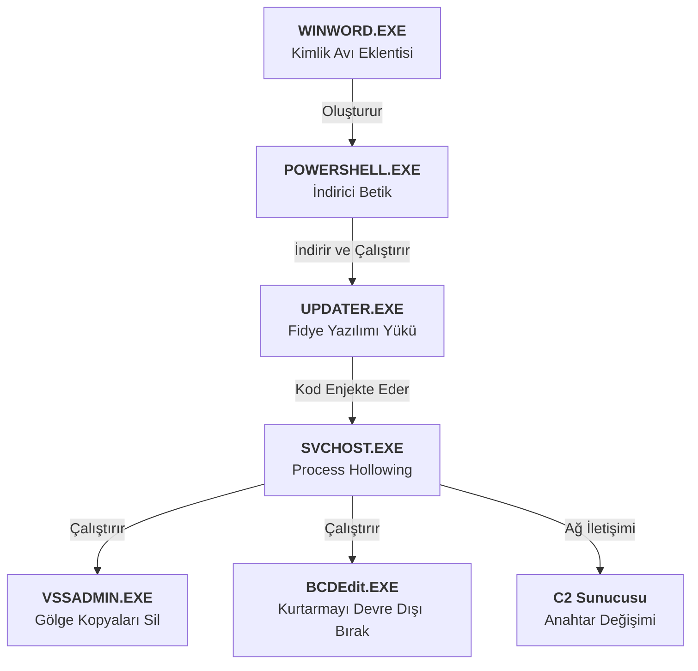

# Modern Fidye Yazılımı Savunması: Reaktif Taramadan Kod Düzeyinde İstihbarata

---

## Yönetici Özeti

Günümüzün siber tehdit ortamında kuruluşlar "eğer" saldırıya uğrarlarsa diye değil, "ne zaman" uğrayacaklarını planlamalıdır. Geleneksel güvenlik araçları, kurumsal ortamları izole varlıkların bir koleksiyonu olarak görür: yama yapılmamış sunucular, şüpheli e-postalar veya yetkisiz erişim girişimleri. Her olay bağımsız olarak değerlendirilir, listeler oluşturulur ve güvenlik ekiplerinin bu sonsuz uyarı kuyruğunu eritmesi beklenir. Ancak bu yaklaşım, asimetrik bir savaşta savunmacıları sürekli dezavantajlı duruma düşürür. Saldırganların yalnızca bir kez başarılı olması yeterliyken, savunmacılar her seferinde başarılı olmak zorundadır.

Modern fidye yazılımları, bu geleneksel perspektifin kör noktalarını hedef almaktadır. Artık basit dosya şifreleyiciler olmaktan çok uzaklaşmışlardır. Günümüzün fidye yazılımları, tersine mühendisliğe dirençli (anti-reversing), sanal makineleri algılayabilen (anti-sandbox), ağ içinde özerk bir şekilde hareket edebilen (solucan benzeri) ve "Living off the Land" taktiklerini kullanarak yasal araçların arkasına saklanan sofistike siber silahlardır. Bu tür tehditlere karşı yalnızca imza tabanlı antivirüsler veya davranışsal analiz araçları kullanarak savunma yapmak, silahlı bir çatışmaya bıçakla gitmeye benzer.

Bu teknik rapor (whitepaper), **Kötü Amaçlı Yazılım Tersine Mühendisliği (Malware Reverse Engineering)** disiplinini ve modern fidye yazılımlarının analizinde kurumsal savunma stratejilerindeki kritik rolünü incelemektedir. Savunma paradigmasının reaktif taramadan; kötü amaçlı yazılımın "zihnini okuyan", kod düzeyinde istihbarat üreten ve saldırganın teknik yeteneklerini ortaya çıkaran proaktif, kanıta dayalı bir güvenlik modeline nasıl dönüştürülebileceğini detaylandırmaktadır. Dahası, WannaCry gibi küresel saldırılardan çıkarılan derslerle, kod analizinin iş sürekliliği ve risk yönetimi üzerindeki doğrudan etkisi nicel verilerle gösterilmektedir.

---

## Sektör ve Tehdit Ortamı

### Asimetrik Karmaşıklık Zorluğu

Modern tehdit ortamı, savunmacıların yönetmesi giderek zorlaşan bir karmaşıklık ve hacim sunmaktadır. 2025 verilerine göre, her 11 saniyede bir kuruluş fidye yazılımı saldırısının kurbanı olmaktadır. Ancak asıl sorun saldırıların sıklığı değil, doğasındaki değişimdir:

1.  **Polimorfik ve Metamorfik Mutasyon**: Saldırganlar her kurban veya kampanya için özel olarak derlenmiş kötü amaçlı yazılım kullanır. Kötü amaçlı yazılımın kod yapısı her seferinde değişerek farklı dosya özet değerleri (hash - MD5/SHA256) üretir. Bu durum, geleneksel "karma veritabanı (hash database)" mantığını tamamen işlevsiz hale getirir. Kötü amaçlı bir yazılım için imza çıkarıldığında, saldırgan kodu çoktan değiştirmiş olur.

2.  **Living off the Land (LotL)**: Modern saldırılar sistemde yüklü olan yasal yönetim araçlarını (PowerShell, WMI, PsExec, BITSAdmin) silah haline getirir. Örneğin, bir saldırganın dosyaları şifrelemek yerine `vssadmin` komutuyla yedekleri silmesi veya PowerShell üzerinden veri sızdırması, bir antivirüs tarafından "yönetici etkinliği" olarak görülebilir. Bu gri alan, sistemde kalma süresini (tespit süresi) 200 güne kadar uzatabilir.

3.  **Hizmet Olarak Fidye Yazılımı (RaaS) Ekonomisi**: Fidye yazılımı ekosistemi profesyonel bir SaaS (Hizmet Olarak Yazılım) iş modeline evrilmiştir. LockBit ve ALPHV (BlackCat) gibi gruplar gelişmiş kötü amaçlı yazılımlarını "satış ortağı" (affiliate) ağlarına kiralarlar.
    
    *   **Çekirdek Geliştiriciler**: Kötü amaçlı yazılımı (locker), ödeme panelini (TOR sitesi) ve şifreleme altyapısını geliştiren ana ekip. %20-30 oranında komisyon alırlar.
    *   **Satış Ortakları (Affiliates)**: Hedefe virüs bulaştıran, ağı hackleyen ve saldırıyı gerçekleştiren taşeronlar. %70-80 oranında pay alırlar.
    *   **İlk Erişim Simsarları (IAB)**: Hedef kurumlara RDP veya VPN erişimi sağlayan ve bu erişimi Satış Ortaklarına satan aracı gruplar.

    

    Bu katmanlı yapı, saldırganların tespit edilmesini zorlaştırdığı gibi, derin teknik bilgisi olmayan suçluların ulus-devlet grupları seviyesinde sofistike saldırılar başlatmasına olanak tanır.


### Saldırgan Metodolojisi: Kill Chain Evrimi

Siber Kill Chain'in modern uyarlamasında, saldırganlar statik savunma hatlarını aşmak için dinamik ve uyarlanabilir yöntemler kullanır:

*   **Analiz Karşıtı (Anti-Analysis) Yetenekler**: Kötü amaçlı yazılımlar artık "durumsal farkındalığa" sahiptir. CPU çekirdek sayısını, fare hareketlerini, yüklü sürücüleri ve hatta sistem "çalışma süresini (uptime)" kontrol ederler. Bir analiz ortamında (Sandbox, VM) olduklarını anlarlarsa kendilerini kapatır veya zararsız bir program (örn. Hesap Makinesi) gibi davranırlar.
*   **Gizleme ve Paketleme (Obfuscation and Packing)**: Kod gizleme teknikleri kötü amaçlı yazılımın "Assembly" kodunu okunamaz hale getirir. Paketleyiciler kötü amaçlı kodu şifreli bir katmanın altına gizler ve ancak çalışma zamanında bellekte açar.
*   **Yalnızca Bellekte Çalıştırma (Fileless)**: Saldırının en tehlikeli boyutu, diskte hiçbir iz bırakmadan gerçekleşmesidir. Kötü amaçlı kod doğrudan belleğe (RAM) enjekte edilir (Process Injection/Hollowing) ve sistem yeniden başlatılana kadar orada yaşar. Dosya taraması yapan güvenlik araçları bu hayaletleri göremez.


Bu yöntemleri anlamak ve onlara karşı savunma yapmak, yüzeysel belirtilere bakmayı bırakıp "Kod Düzeyinde" derinliğe inmeyi gerektirir.


---

## Geleneksel Güvenlik Yaklaşımlarının Sınırları

### Silolaşmış Güvenlik Araçları

Geleneksel güvenlik yığını, tehditleri bütünsel bir resimden ziyade parçalanmış bir yapıda ele alır. Bu durum "Görünürlük Siloları" oluşturur:

**Antivirüs (AV)**: Temel olarak dosya imza eşleşmesine dayanır. Gücü, veritabanının güncelliği ile sınırlıdır. "Bilinmeyen" (Zero-day) veya "Özel (Custom)" kötü amaçlı yazılımlara karşı kördür. Ayrıca, kodun amacından çok yapısına odaklandığı için LotL taktiklerini gözden kaçırır.

**Otomatik Sandbox Çözümleri**: Şüpheli dosyaları izole bir ortamda çalıştırır ve raporlar. Ancak bu durum bir kedi-fare oyununa dönüşmüştür. Sandbox'lar analiz süresini (örn. 5 dakika) hızlandırmaya çalışırken, kötü amaçlı yazılımlar aktif hale gelmeden önce "Uyku (Sleep)" komutlarını kullanarak 20 dakika bekleyerek bu analizleri atlatabilir.

**EDR Çözümleri**: Uç nokta (endpoint) davranışlarını izler ve anormallikleri raporlar. En gelişmiş çözüm olmasına rağmen, EDR'lar genellikle "Kullanıcı Modu (User-Mode)" düzeyinde çalışır ve "Çekirdek Modu (Kernel-Mode)" rootkit'leri veya gelişmiş körleştirme teknikleri tarafından atlatılabilir (Blinding EDR). Ayrıca şifrelenmiş trafik içindeki C2 komutlarını çözemezler.

Her araç yapbozun bir parçasını sağlar, ancak hiçbiri kötü amaçlı yazılımın "genetiğini", "niyetini" ve "yetenek sınırlarını" tam olarak ortaya koyamaz.

### Listeye Dayalı Önceliklendirme ile Riske Dayalı Gerçeklik

Güvenlik operasyon ekipleri (SOC), tehditleri tipik olarak statik ve izole niteliklere göre önceliklendirir:

*   **Karma İtibarı (Hash Reputation)**: "Bu dosya karması daha önce VirusTotal'da kırmızı ile işaretlendi mi?"
*   **Dosya Türü**: "Bu dosya çalıştırılabilir bir dosya mı (.exe) yoksa bir belge mi (.pdf)?"
*   **Kaynak IP**: "Gelen IP adresi bilinen bir botnet listesinde mi?"

Bu faktörler önemlidir ancak yanıltıcı olabilir. Temiz bir PDF dosyası kötü amaçlı JavaScript içerebilir. Veya "temiz" bir IP adresi, saldırgan tarafından ele geçirilmiş meşru bir sunucu olabilir. Geleneksel listeye dayalı yaklaşım şu temel soruyu kaçırır: **"Bu kod parçası henüz bilinmeyen bir güvenlik açığını kullanarak veya yasal bir süreci manipüle ederek iş süreçlerimizi nasıl durdurabilir?"**

---

## Teknik Temel

### Tersine Mühendisliğin Sanatı ve Bilimi

Tersine Mühendislik (RE), kaynak koduna sahip olunmayan derlenmiş bir yazılımın (binary) çalışma mantığını, veri yapılarını ve algoritmalarını deşifre etme sürecidir. Bu disiplin, kötü amaçlı yazılımı "anlaşılmaz bir kara kutudan" "okunabilir bir savaş haritasına" dönüştürür.

#### 1. Statik Analiz: Anatomiyi İncelemek

Statik analiz, kodu çalıştırmadan yapısını incelemektir. Assembly (ASM) kodunu ve Kontrol Akış Grafiğini (CFG) görüntülemek için **IDA Pro, Ghidra, Binary Ninja** gibi araçlar kullanılır.

*   **İçe Aktarma Adres Tablosu (IAT) Analizi**: Kötü amaçlı yazılımın işletim sisteminden talep ettiği işlevler (fonksiyonlar) incelenir. Örneğin `CryptEncrypt` işlevini çağırıyorsa şifreleme yeteneğine sahiptir; `InternetOpenUrl` işlevini çağırıyorsa ağ iletişim yeteneğine sahiptir.
*   **Dize (String) Analizi**: Kod içindeki okunabilir metinler (IP adresleri, dosya yolları, hata mesajları, taslak fidye notları) ipuçları sağlar. WannaCry vakasındaki "Killswitch URL'si" bu yöntemle bulunmuştur.
*   **Kaynak Bölümü (Resource Section) Analizi**: Kötü amaçlı yazılımın içine gizlenmiş diğer dosyalar (yapılandırma dosyaları, resimler, ek zararlı modüller) incelenir.


#### 2. Dinamik Analiz: Davranışı Gözlemlemek


Dinamik analiz, kötü amaçlı yazılımı izole edilmiş ve kontrollü bir laboratuvar ortamında çalıştırarak (debugger: **x64dbg, WinDbg, OllyDbg**) bellekteki, ağdaki ve dosya sistemindeki canlı davranışını izlemektir.

*   **API Kancalama (API Hooking)**: Kötü amaçlı yazılım tarafından yapılan Sistem Çağrıları (System Calls) engellenir. "Hangi dosyayı açmaya çalışıyor?", "Hangi kayıt defteri (registry) anahtarını değiştiriyor?" gibi sorular yanıtlanır.
*   **Bellek Analizi**: Kötü amaçlı yazılım bellekte kendini açtığında (Unpacking), şifrelenmiş kodun orijinal biçimi (Payload) RAM'den boşaltılır (Memory Dump).
*   **Ağ Dinleme (Network Sniffing)**: C2 sunucusu ile şifrelenmiş trafik, SSL/TLS sonlandırması veya hata ayıklayıcı (debugger) yardımıyla düz metin olarak okunmaya çalışılır.

### Kötü Amaçlı Yazılımlarda Matematiksel ve Mantıksal Kavramlar

Tersine mühendislik, kötü amaçlı yazılımlar tarafından kullanılan algoritmaları deşifre eder. İşte modern fidye yazılımları tarafından sıklıkla kullanılan bazı yapılar:

**Şifreleme Rutini (Sözde Kod - Pseudo-Code Örneği):**
Fidye yazılımları genellikle hibrit şifreleme kullanır. Dosya başına simetrik anahtar, anahtar için asimetrik şifreleme.

```c
// Kötü amaçlı yazılımın dosya şifreleme döngü mantığı
void EncryptFile(char* filePath) {
    BYTE* fileContent = ReadFile(filePath);
    BYTE* aesKey = GenerateRandomKey(256); // 256 bit AES anahtarı üret
    BYTE* iv = GenerateRandomIV(128);      // Başlatma Vektörü (IV)

    BYTE* encryptedContent = AES_Encrypt(fileContent, aesKey, iv);
    
    // Simetrik anahtarı saldırganın Genel Anahtarı (Public Key) ile şifrele
    BYTE* encryptedKey = RSA_Encrypt(aesKey, PUBLIC_KEY_EMBEDDED);
    
    WriteFile(filePath, encryptedKey + iv + encryptedContent);
}
```


*Bu algoritmanın analizi, saldırganın "Rastgele Sayı Üretici" (RNG) fonksiyonunu zayıf kullanıp kullanmadığını ortaya çıkarır. Eğer zayıfsa, fidye ödemeden şifre kırılabilir.*


**Alan Adı Üretme Algoritmaları (DGA - Domain Generation Algorithms):**
C2 sunucusunun engellenmesini önlemek için zararlı yazılım her gün farklı alan adları üretir.
*Formül:* `Alan Adı = Hash(Tarih + Tohum) + ".com"`
Bir tersine mühendis, saldırganın yarın kullanacağı alan adlarını bugünden engellemek (Pre-emptive Blocking) için bu `Hash` ve `Tohum (Seed)` değerini koddan çıkarabilir.

---

## Simüle Edilmiş Laboratuvar Analizi: Any.run Bulut Sandbox Sonuçları

Tersine mühendislik bulgularımızı doğrulamak için kötü amaçlı yazılım örneğini kontrollü bir bulut sandbox ortamında (**Any.run**) çalıştırdık. Bu simülasyon, kötü amaçlı yazılımın atlatma ve yayılma tetikleyicilerini gözlemlemek için standart bir Windows 10 kurumsal iş istasyonunu taklit eder.

### 1. Etkileşimli Süreç Grafiği (Davranışsal Ağaç)
Aşağıdaki yürütme (execution) ağacı, kötü amaçlı yazılımın **"Process Hollowing"** tekniğini göstermektedir. İlk yük (payload), tespit edilmekten kaçınmak için hemen yasal bir sistem süreci (`svchost.exe`) oluşturur ve içine kötü amaçlı kod enjekte eder.

![Şekil 5: Bulaşma zincirini gösteren kavramsal süreç grafiği.]



### 2. Ağ Telemetrisi ve HTTP İstekleri
Sandbox, Komuta ve Kontrol (C2) sunucularına yönelik anlık "Beaconing (Sinyal Gönderme)" etkinliğini yakaladı.

**Gözlemlenen Ağ Akışları:**
| Zaman Damgası | Süreç Adı | Hedef IP/URL | Protokol | Durum | Sınıflandırma |
| :--- | :--- | :--- | :--- | :--- | :--- |
| **00:03.2** | powershell.exe | `hxxps://cdn.discordapp[.]com/attachments/...` | HTTPS | 200 OK | **Yük İndirme** |
| **00:15.5** | svchost.exe | `http://api.ipify[.]org` | HTTP | 200 OK | **Keşif (Genel IP)** |
| **00:45.1** | svchost.exe | `185.25.x.x:443` | TCP | ESTABLISHED | **C2 El Sıkışması** |
| **01:20.9** | svchost.exe | `192.168.1.0/24` | SMB | SYN_SENT | **Yanal Hareket (Tarama)** |

### 3. MITRE ATT&CK Eşlemesi (Gözlemlenen)
Any.run sandbox raporuna dayanarak, gözlemlenen davranışları tehdit avcılığı için MITRE ATT&CK çerçevesiyle eşleştirdik.

| Taktik | Kimlik (ID) | Teknik | Gözlemlenen Gösterge |
| :--- | :--- | :--- | :--- |
| **Execution (Çalıştırma)** | T1059.001 | PowerShell | `powershell.exe -enc <Base64>` |
| **Defense Evasion (Savunmadan Kaçınma)** | T1055 | Süreç Enjeksiyonu | `svchost.exe` (PID 4402) geçişi |
| **Impact (Etki)** | T1490 | Sistem Kurtarmayı Engelleme | `vssadmin.exe Delete Shadows /all /quiet` |
| **Command & Control**| T1071 | Uygulama Katmanı Protokolü | `discordapp.com` trafiği (Yasal Web Servisi) |

### 4. Bırakılan Eserler (Artifacts) ve Kayıt Defteri Değişiklikleri
**Dosya Sistemi:**
- `%TEMP%\updater.exe` (İlk Bırakıcı - Dropper)
- `C:\Users\Public\Music\enc_log.txt` (Şifreleme Günlüğü)

**Kayıt Defteri:**
- Anahtar: `HKCU\Software\Microsoft\Windows\CurrentVersion\Run\OneDriveUpdate`
- Değer: `C:\Windows\System32\svchost.exe -k netsvcs` (Kalıcılık)

## Operasyonel Senaryolar: Saldırıya Karşı Savunma

Bir güvenlik ortağı olarak olayları "Saldırı Yolları" merceğinden değerlendiriyoruz. Aşağıda standart bir saldırının nasıl geliştiği ve buna karşılık gelen tespit fırsatlarının bir dökümü yer almaktadır.

### Senaryo 1: İlk Erişim ve Kaçınma
**Saldırganın Amacı**: AV'yi tetiklemeden bir dayanak noktası elde etmek.

| Saldırı Adımı | Teknik Detay | Savunma Boşluğu (Neden Başarısız Olur) | Danışmanlık Tavsiyesi |
| :--- | :--- | :--- | :--- |
| **Teslimat (Delivery)** | Word Belgesinde Kötü Amaçlı Makro | **Kullanıcı Farkındalığı**: Kullanıcılar eğitimlidir ancak yorgunluk tıklamalara yol açar. | GPO aracılığıyla **Makroları Devre Dışı Bırakın**; **CDR** (İçerik Etkisizleştirme ve Yeniden Yapılandırma) kullanın. |
| **Çalıştırma (Execution)** | PowerShell betiği bellekte çalışır | **İmza Atlatma**: Dosyasız (fileless) zararlı yazılımın AV için disk ayak izi yoktur. | **Betik Bloğu Günlüğünü (Script Block Logging)** etkinleştirin (Olay 4104); AMSI entegrasyonlu **EDR** kullanın. |

### Senaryo 2: Yanal Hareket ve Fidye
**Saldırganın Amacı**: Ayrıcalıkları yükseltmek ve etki alanını (domain) şifrelemek.

| Saldırı Adımı | Teknik Detay | Savunma Boşluğu (Neden Başarısız Olur) | Danışmanlık Tavsiyesi |
| :--- | :--- | :--- | :--- |
| **Kimlik Bilgisi Dökümü** | LSASS Bellek Dökümü (Mimikatz) | **Ayrıcalık Yönetimi**: Yerel Yönetici hakları yaygındır. | **Credential Guard** (Win 10+); Yerel yönetici şifre rotasyonu için **LAPS**. |
| **Şifreleme** | Çok iş parçacıklı AES döngüsü | **Yedekleme Hataları**: Şirket içi (On-site) yedekler de şifrelenir. | **Değiştirilemez (Immutable) Yedekler** (WORM Depolama); Etki alanını sınırlamak için **Ağ Bölümleme (Network Segmentation)**. |

---


## Modern Güvenlik Doğrulama Çerçevesi

### Varsayımdan Doğrulamaya

Tersine mühendislik çıktılarını güvenlik operasyonlarına entegre etmek, kuruluşun savunma modelini "Varsayım"dan "Güvenlik Doğrulaması"na taşır.

**Otomatik Sandbox ve Manuel Kod İstihbaratı Karşılaştırması**

| Özellik | Otomatik Sandbox | Manuel Tersine Mühendislik |
|---------|-------------------|----------------------------|
| **Analiz Süresi** | 2-10 Dakika | 4-48 Saat |
| **Kapsam** | Yüzeysel Davranışlar | Derin Kod Mantığı |
| **Direnç** | Atlatılabilir (Anti-VM) | İnsan Zekasıyla Aşılır |
| **Çıktı** | Genel Alarm | Kesin IOC ve Taktiksel İstihbarat |
| **Sonuç** | "Dosya zararlı olabilir" | "Dosya DGA kullanarak bu IP ile iletişim kuruyor" |


### Entegre Savunma Yaşam Döngüsü


Kod düzeyinde istihbarat, güvenlik döngüsünün her aşamasını besler:

1.  **Önleme (Prevention)**: DGA algoritmasından elde edilen gelecekteki alan adlarının Güvenlik Duvarı/DNS seviyesinde engellenmesi.
2.  **Tespit (Detection)**: Kötü amaçlı yazılımın bellekte oluşturduğu bir "Mutex" nesnesi veya özel bir "User-Agent" dizesi için SIEM kuralları yazılması.
3.  **Müdahale (Response)**: Kötü amaçlı yazılımın oluşturduğu kalıcılık mekanizmalarını (Kayıt Defteri Run Anahtarları, Zamanlanmış Görevler) temizlemek için özel komut dosyalarının hazırlanması.

---

## İş ve Risk Etkisi

### Stratejik İyileştirme ve Yatırım Getirisi (ROI)

Derinlemesine analiz yeteneğine yapılan Yatırım Getirisi (ROI) sadece teknolojik değil, finansal ve stratejiktir:

**Maliyetten Kaçınma**:
Bir fidye yazılımı saldırısının ortalama maliyeti 1.85 Milyon Dolardır (IBM 2024 Raporu). Bir "Killswitch" keşfetmek veya tersine mühendislik yoluyla şifre çözücüyü kırmak bu maliyeti sıfıra indirebilir. 5.000 dolarlık bir analiz eğitimi veya hizmeti, milyonlarca dolarlık hasarı önleyebilir.

**Operasyonel Dayanıklılık**:
Bir saldırıdan sonra "Sistemleri ne zaman açabiliriz?" sorusunun cevabı, belirsizliğe değil, kod analizinden elde edilen kesin bilgilere dayanır. "Kötü amaçlı yazılımın yayılma modülü yok, sadece çalıştığı makineyi etkiliyor" bilgisini bilmek, tüm fabrikayı kapatmak yerine sadece etkilenen makineyi izole etme kararının alınmasını sağlar. Bu durum üretim kaybını en aza indirir.

**İtibar Yönetimi**:
GDPR süreçlerinde, verilerin sızdırılmadığını kanıtlamak hayati önem taşır. Kötü amaçlı yazılımın kodunda veri sızdırma (exfiltration) işlevi olmadığını kanıtlamak, kurumu devasa para cezalarından ve müşteri güveni kaybından korur.

### Yönetim Kurulu İletişim Metrikleri

Yönetim kuruluna sunulan metrikler teknik detaylardan arındırılmalı ve risk diline çevrilmelidir:

*   *"Bilinmeyen tehditleri analiz etme süremizi 4 günden 4 saate indirdik."*
*   *"Sektörümüzü hedef alan son 3 fidye yazılımı varyantına karşı, onlar saldırmadan önce bağışıklık kazandık."*
*   *"Olay müdahale maliyetlerimizde %60 tasarruf sağladık."*

---

## Yönetmeliklerle Uyum

### Düzenleyici ve Uyumluluk Gereksinimleri

Tersine mühendislik ve kod analizi, uluslararası yönetmeliklerin "Özen Yükümlülüğü (Due Diligence)" gerekliliklerini doğrudan karşılar:

*   **NIST Siber Güvenlik Çerçevesi (CSF) 2.0**:
    *   *DE.AE (Tespit Süreçleri)*: Saldırıları anlamak için analiz süreçlerinin işletilmesi.
    *   *RS.AN (Müdahale Analizi)*: Olayın kapsamını anlamak için analiz yapılması.
*   **GDPR (Genel Veri Koruma Yönetmeliği)**:
    *   Madde 33/34: Veri ihlalinin niteliğinin ve sonuçlarının detaylı raporlanması. Kod analizi, ihlalin niteliğini (hangi verilerin hedeflendiğini) teknik olarak kanıtlayan en güçlü delildir.
*   **ISO 27001:2022**:
    *   *A.8.7 (Kötü amaçlı yazılımlara karşı koruma)*: Kötü amaçlı yazılımlara karşı koruma kontrollerinin doğrulanması.

---

## Sonuç

Siber güvenlikte savunmacıların "listeleme ve yamalama" mantığı ile saldırganların "kodlama ve evrilme" mantığı arasındaki uçurum, en güvenli olduğunu iddia eden kurumların bile neden hacklendiğini açıklamaktadır. Geleneksel araçlar gereklidir ancak yeterli değildir.

Bu uçurumu kapatmak için kuruluşlar aşağıdaki adımları atmalıdır:

1.  **İstihbaratta Sola Kayma (Shift Left in Intelligence)**: Tehdit istihbaratını sadece dışarıdan satın alınan bir "akış (feed)" olarak değil, kendi sistemlerine saldıran kodlardan üretilen "içsel bir varlık" olarak değerlendirmek.
2.  **İnsan Kaynağına Yatırım**: Otomatik araçların yetersiz kaldığı durumlarda devreye girecek tersine mühendislik yetkinliğine sahip insan kaynaklarına veya iş ortaklarına yatırım yapmak.
3.  **Sürekli Doğrulama**: Güvenlik duruşunu varsayımlarla değil, gerçek kötü amaçlı yazılım analizlerinden elde edilen kanıtlarla sürekli olarak doğrulamak.

Geleceğin savunması sadece kodları engelleyebilenlerin değil; kodları okuyabilen, anlayabilen ve onlara karşı kendi kodunu geliştirebilenlerin ellerinde olacaktır.
