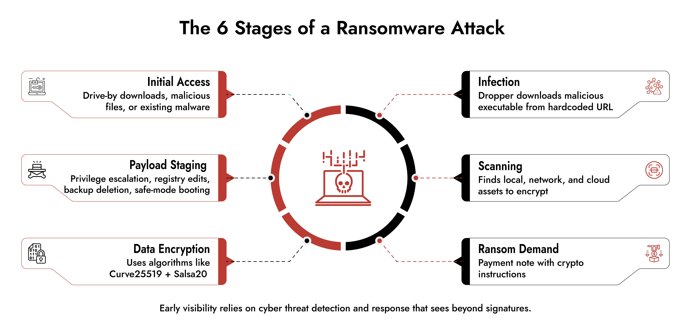

# Inside the Threats: A Consultant's View on Ransomware Reversing

As security consultants operating on the front lines of cyber defense, we witness a disturbing trend in 2026: attackers are no longer just encrypting data; they are dismantling trust. Our recent engagements show that traditional "install antivirus and forget" strategies are failing against next-generation ransomware that shapeshifts at machine speed.

## Introduction: The Invisible Enemy

In our forensic labs, we see a recurring pattern: when malware enters a client's system, it leaves no traditional trace. Modern ransomware hides within legitimate system processes, detects antivirus scans, and shuts itself down if it senses an analyst watching.

The question we ask every CISO is not "Will you be attacked?", but "When attacked, can your team understand exactly what the malware did in seconds?" This is where our expertise in **Reverse Engineering** becomes the cornerstone of defense.

## The Core Security Challenge: What We See in the Field

Traditional security architectures were designed for slower and more predictable adversaries. Signatures were updated, scans were run, and files were quarantined. However, this model fails against modern ransomware for three fundamental reasons:

**Static Analysis Blindness**: Attackers use "polymorphic" packers that constantly change their code. These codes, randomly generated for each victim and unpacked only in memory, appear as completely meaningless data to classic static analysis tools.Q

**Anti-Analysis Traps**: Next-generation malware realizes when it is being analyzed by an analyst. They check for virtual machine (VM) core counts, mouse movements, or the presence of a debugger. If they detect an analysis environment, they act like an innocent notepad and go to sleep.

**Dynamic Targeting**: Malware is no longer a dumb piece of code. It analyzes the language, keyboard layout, and even the Active Directory structure of the system it runs on. If it's on the wrong target, it deletes itself; if it's on the right target, it prioritizes the most critical data (like backup servers).

## Real-World Attack Perspective

Consider how a modern ransomware attack (e.g., the WannaCry or BlackCat variants we analyzed) unfolds:

**Phase 1 - Infiltration & Evasion**: The malware infiltrates the system via phishing or RDP brute-force. Its first job is not to encrypt; it is to hide. It injects itself into a legitimate `svchost.exe` process (Process Hollowing) and drops off the radar of security software.

**Phase 2 - Environment Reconnaissance**: When the malicious code unpacks in memory, it silently listens to the environment. Which antivirus is running? Is there internet access? Where are the Shadow Copy backups? Without reverse engineering, this phase is never seen because there is no file activity on the disk.

**Phase 3 - Lateral Movement & Encryption**: Once targets are identified, the attack begins. First, backups are deleted (`vssadmin delete`), then network shares are scanned, and encryption keys are sent to the C2 server. This phase usually happens at midnight or on weekends, when IT teams are away.

## Modern Security Approach

Defending against these advanced threats requires a fundamental shift in security philosophy. The goal is not to prevent all attacks (that's mathematically impossible), but to understand the attack and minimize response time.

**Code-Level Visibility**: Security operations (SOC) must look not only at logs but also at the code structure of suspicious files. where automated sandbox analyses fail, manual reverse engineering can find the malware's "killswitch" or weak point.

**Threat Hunting with IOCs**: Proactive hunting must be done on the network with data obtained from analysis (mutex names, special user-agent strings). A threat detected on one machine can be stopped with these "Indicator of Compromise" data before it spreads to thousands of other machines.

**Adversary Understanding**: Knowing your enemy comes from reading their code. An error in the encryption algorithm used by the attacker or a flaw in C2 communication can allow data to be recovered without paying the ransom.

## Conclusion

Ransomware are not just "files"; they are sophisticated weapons designed to destroy your organization's digital assets. Organizations that rely only on automated tools and generic security rules are trying to fight an invisible enemy.

The strategic imperative is clear: defenders must respond to the complexity of attackers with "in-depth analysis" and "code-level intelligence". Security begins when you can see the invisible and decode the enemy.
