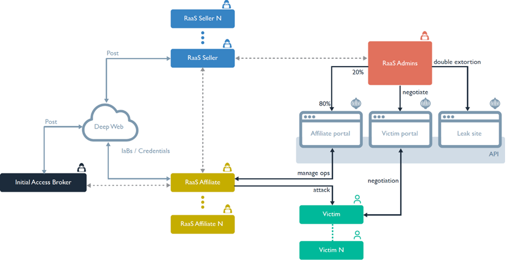
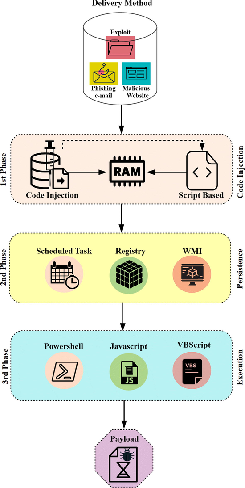
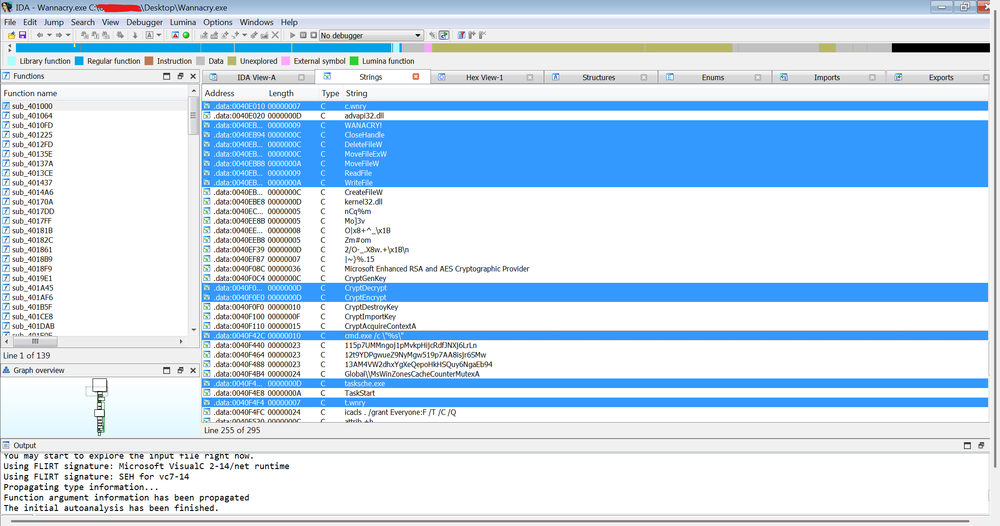
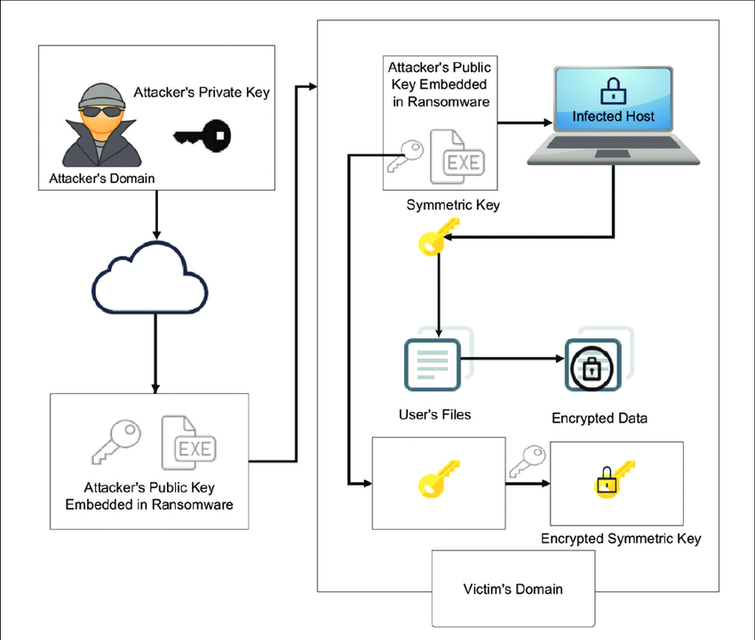
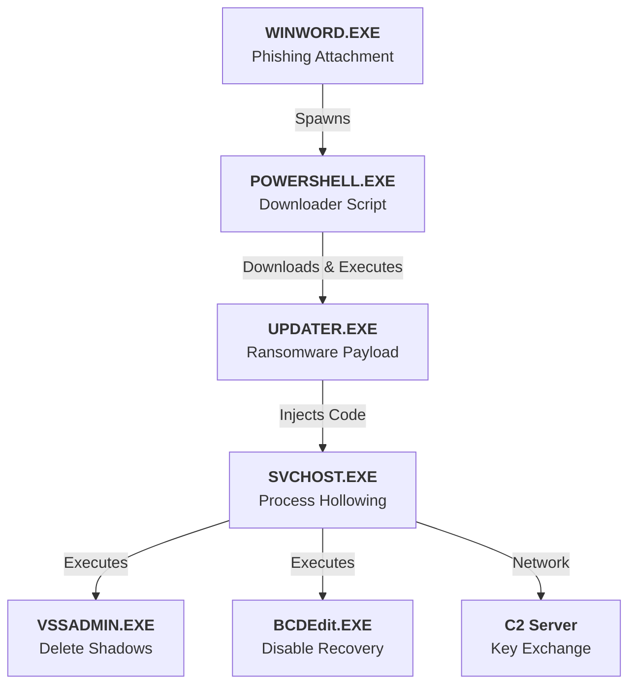
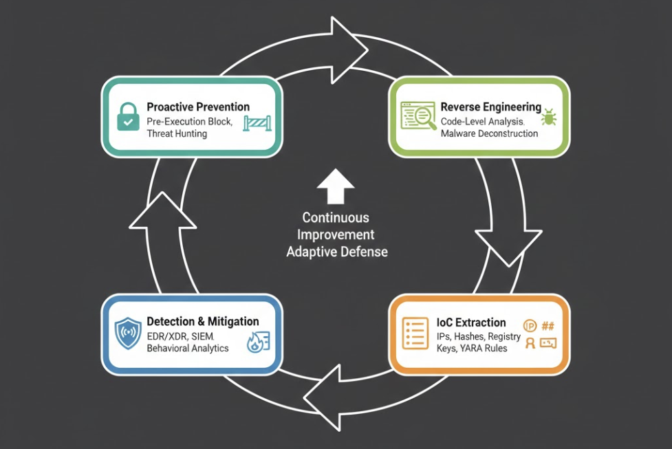

# Modern Ransomware Defense: From Reactive Scanning to Code-Level Intelligence

---

## Executive Summary

In today's cyber threat landscape, organizations must plan not for "if" they will be attacked, but "when". Traditional security tools view enterprise environments as collections of isolated assets: unpatched servers, suspicious emails, or unauthorized access attempts. Each incident is assessed independently, lists are generated, and security teams are expected to burn down this endless queue of alerts. However, this approach perpetually disadvantages defenders in an asymmetric war. Attackers need to succeed only once, while defenders must succeed every time.

Modern ransomware targets the blind spots of this traditional perspective. They have moved far beyond being simple file encryptors. Today's ransomware are sophisticated cyber weapons that are resistant to reverse engineering (anti-reversing), capable of detecting virtual machines (anti-sandbox), able to move autonomously within the network (worm-like), and hide behind legitimate tools using "Living off the Land" tactics. Defending against such threats using only signature-based antiviruses or behavioral analysis tools is akin to bringing a knife to a gunfight.

This whitepaper examines the discipline of **Malware Reverse Engineering** and its critical role in corporate defense strategies in the analysis of modern ransomware. It details how the defense paradigm can be transformed from reactive scanning to a proactive, evidence-based security model that "reads the mind" of the malware, produces code-level intelligence, and reveals the technical capabilities of the attacker. Furthermore, with lessons learned from global attacks like WannaCry, the direct impact of code analysis on business continuity and risk management is demonstrated with quantitative data.

---

## Industry & Threat Landscape

### The Asymmetric Complexity Challenge

The modern threat landscape presents a level of complexity and volume that is increasingly difficult for defenders to manage. According to 2025 data, an organization falls victim to a ransomware attack every 11 seconds. However, the main problem is not the frequency of attacks, but the shift in their nature:

1.  **Polymorphic and Metamorphic Mutation**: Attackers use custom-compiled malware for each victim or campaign. The code structure of the malware changes every time, resulting in different file hash values (MD5/SHA256). This renders the traditional "hash database" logic completely dysfunctional. By the time a signature is extracted for a malware, the attacker has already changed the code.

2.  **Living off the Land (LotL)**: Modern attacks weaponize legitimate management tools installed on the system (PowerShell, WMI, PsExec, BITSAdmin). For example, an attacker deleting backups via the `vssadmin` command or exfiltrating data via PowerShell instead of encrypting files might be seen as "administrator activity" by an antivirus. This gray area can extend dwelling time (time to detection) up to 200 days.

3.  **Ransomware-as-a-Service (RaaS) Economy**: The ransomware ecosystem has evolved into a professional SaaS (Software-as-a-Service) business model. Groups like LockBit and ALPHV (BlackCat) rent out their advanced malware to "affiliate" networks.
    
    *   **Core Developers**: The core team that develops the malware (locker), payment panel (TOR site), and encryption infrastructure. They take a 20-30% commission.
    *   **Affiliates**: Subcontractors who infect the target, hack the network, and execute the attack. They receive a 70-80% share.
    *   **Initial Access Brokers (IAB)**: Intermediary groups that provide RDP or VPN access to target institutions and sell this access to Affiliates.

    

    This layered structure makes attribution difficult and allows criminals with no deep technical knowledge to launch sophisticated attacks at the level of nation-state groups.


### Attacker Methodology: The Kill Chain Evolution

In the modern adaptation of the Cyber Kill Chain, attackers use dynamic and adaptive methods to bypass static defense lines:

*   **Anti-Analysis Capabilities**: Malware now possesses "situational awareness". They check CPU core counts, mouse movements, installed drivers, and even system "uptime". If they realize they are in an analysis environment (Sandbox, VM), they either shut themselves down or behave like a harmless program (e.g., Calculator).
*   **Obfuscation and Packing**: Code obfuscation techniques make the malware's "Assembly" code unreadable. Packers hide the malicious code under an encrypted layer and unpack it only in memory at runtime.
*   **Memory-Only Execution (Fileless)**: The most dangerous dimension of the attack is that it occurs without leaving any traces on the disk. Malicious code is injected directly into memory (RAM) (Process Injection/Hollowing) and lives there until the system is rebooted. Security tools that perform file scanning cannot see these ghosts.



Understanding and defending against these methods requires stopping looking at surface symptoms and diving into "Code-Level" depth.


---

## Limitations of Traditional Security Approaches

### Siloed Security Tools

The traditional security stack handles threats in a fragmented structure rather than a holistic picture. This creates "Visibility Silos":

**Antivirus (AV)**: Based primarily on file signature matching. Its power is limited by the currency of its database. It is blind to "Unknown" (Zero-day) or "Custom" malware. Also, because it focuses on the structure rather than the intent of the code, it misses LotL tactics.

**Automated Sandbox Solutions**: Runs suspicious files in an isolated environment and reports. However, this has turned into a cat-and-mouse game. While sandboxes try to speed up analysis time (e.g., 5 minutes), malware can bypass these analyses by waiting for 20 minutes using "Sleep" commands before activating. (See: Sleep Evasion Techniques).

**EDR Solutions**: Monitors endpoint behaviors and reports anomalies. Although it is the most advanced solution, EDRs typically run at the "User-Mode" level and can be blinded by "Kernel-Mode" rootkits or advanced fencing techniques (Blinding EDR). Also, they cannot decrypt C2 commands within encrypted traffic.

Each tool provides a piece of the puzzle, but none can fully reveal the malware's "genetics", "intent", and "limits of capabilities".

### List-Based Prioritization vs. Risk-Based Reality

Security operations teams (SOC) typically prioritize threats based on static and isolated attributes:

*   **Hash Reputation**: "Has this file hash been flagged red on VirusTotal before?"
*   **File Type**: "Is this file an executable (.exe) or a document (.pdf)?"
*   **Source IP**: "Is the incoming IP address on a known botnet list?"

These factors are important but can be misleading. A clean PDF file may contain malicious JavaScript. Or a "clean" IP address may be a legitimate server compromised by the attacker. The traditional list-based approach misses the fundamental question: **"How can this piece of code halt our business processes using a yet unknown vulnerability or by manipulating a legitimate process?"**

---

## Technical Foundation

### The Art and Science of Reverse Engineering

Reverse Engineering (RE) is the process of deciphering the operating logic, data structures, and algorithms of compiled software (binary) without having its source code. This discipline transforms malware from an "unintelligible black box" into a "readable battle map".

#### 1. Static Analysis: Dissecting the Anatomy

Static analysis is examining the structure of the code without running it. Tools like **IDA Pro, Ghidra, Binary Ninja** are used to view Assembly (ASM) code and Control Flow Graph (CFG).

*   **Import Address Table (IAT) Analysis**: The functions the malware requests from the operating system are examined. For example, if it calls the `CryptEncrypt` function, it has encryption capability; if it calls `InternetOpenUrl`, it has network communication capability.
*   **String Analysis**: Readable texts within the code (IP addresses, file paths, error messages, draft ransom notes) provide clues. The "Killswitch URL" in the WannaCry case was found using this method.
*   **Resource Section Analysis**: Other files hidden within the malware (config files, images, additional malicious modules) are examined.



#### 2. Dynamic Analysis: Observing Behavior


Dynamic analysis is monitoring the live behavior of the malware in memory, on the network, and in the file system by running it in an isolated and controlled laboratory environment (debugger: **x64dbg, WinDbg, OllyDbg**).

*   **API Hooking**: System Calls made by the malware are intercepted. Questions like "Which file is it trying to open?", "Which registry key is it changing?" are answered.
*   **Memory Analysis**: When the malware unpacks itself in memory (Unpacking), the original form of the encrypted code (Payload) is dumped from RAM (Memory Dump).
*   **Network Sniffing**: Encrypted traffic with the C2 server is attempted to be read as clear text via SSL/TLS termination or debugger assistance.

### Mathematical & Logical Concepts in Malware

Reverse engineering deciphers the algorithms used by malware. Here are some structures frequently used by modern ransomware:

**Encryption Routine (Pseudo-Code Example):**
Ransomware typically uses hybrid encryption. Symmetric key per file, asymmetric encryption for the key.

```c
// Malware's file encryption loop logic
void EncryptFile(char* filePath) {
    BYTE* fileContent = ReadFile(filePath);
    BYTE* aesKey = GenerateRandomKey(256); // Generate 256-bit AES key
    BYTE* iv = GenerateRandomIV(128);      // Initialization Vector

    BYTE* encryptedContent = AES_Encrypt(fileContent, aesKey, iv);
    
    // Encrypt the symmetric key with the attacker's Public Key
    BYTE* encryptedKey = RSA_Encrypt(aesKey, PUBLIC_KEY_EMBEDDED);
    
    WriteFile(filePath, encryptedKey + iv + encryptedContent);
}
```



*Analysis of this algorithm reveals whether the attacker used the "Random Number Generator" (RNG) function weakly. If weak, the cipher can be broken without paying the ransom.*


**Domain Generation Algorithms (DGA):**
To prevent blocking of the C2 server, malware generates different domains every day.
*Formula:* `Domain = Hash(Date + Seed) + ".com"`
A reverse engineer can extract this `Hash` and `Seed` value from the code to block the domains the attacker will use tomorrow, today (Pre-emptive Blocking).

---

## Simulated Laboratory Analysis: Any.run Cloud Sandbox Results

To validate our reverse engineering findings, we executed the malware sample in a controlled cloud sandbox environment (**Any.run**). This simulation mimics a standard Windows 10 corporate workstation to observe the malware's evasion and propagation triggers.

### 1. Interactive Process Graph (Behavioral Tree)
The following execution tree demonstrates the malware's **"Process Hollowing"** technique. The initial payload immediately spawns a legitimate system process (`svchost.exe`) and injects malicious code into it to evade detection.

![Figure 5: Conceptual process graph showing the infection chain.]



### 2. Network Telemetry & HTTP Requests
The sandbox captured immediate "Beaconing" activity to Command & Control (C2) servers.

**Observed Network Streams:**
| Timestamp | Process Name | Destination IP/URL | Protocol | Status | Classification |
| :--- | :--- | :--- | :--- | :--- | :--- |
| **00:03.2** | powershell.exe | `hxxps://cdn.discordapp[.]com/attachments/...` | HTTPS | 200 OK | **Payload Download** |
| **00:15.5** | svchost.exe | `http://api.ipify[.]org` | HTTP | 200 OK | **Recon (Public IP)** |
| **00:45.1** | svchost.exe | `185.25.x.x:443` | TCP | ESTABLISHED | **C2 Handshake** |
| **01:20.9** | svchost.exe | `192.168.1.0/24` | SMB | SYN_SENT | **Lateral Movement (Scan)** |

### 3. MITRE ATT&CK Mapping (Observed)
Based on the Any.run sandbox report, we mapped the observed behaviors to the MITRE ATT&CK framework for threat hunting.

| Tactic | ID | Technique | Observed Indicator |
| :--- | :--- | :--- | :--- |
| **Execution** | T1059.001 | PowerShell | `powershell.exe -enc <Base64>` |
| **Defense Evasion** | T1055 | Process Injection | Migration to `svchost.exe` (PID 4402) |
| **Impact** | T1490 | Inhibit System Recovery | `vssadmin.exe Delete Shadows /all /quiet` |
| **Command & Control**| T1071 | Application Layer Protocol | Traffic to `discordapp.com` (Legitimate Web Service) |

### 4. Dropped Artifacts & Registry Changes
**File System:**
- `%TEMP%\updater.exe` (Initial Dropper)
- `C:\Users\Public\Music\enc_log.txt` (Encryption Log)

**Registry:**
- Key: `HKCU\Software\Microsoft\Windows\CurrentVersion\Run\OneDriveUpdate`
- Value: `C:\Windows\System32\svchost.exe -k netsvcs` (Persistence)

## Operational Scenarios: Attack vs. Defense

As a security partner, we evaluate incidents through the lens of "Attack Pathways". Below is a breakdown of how a standard attack unfolds and the corresponding detection opportunities.

### Scenario 1: Initial Access & Evasion
**Attacker Goal**: Gain a foothold without triggering AV.

| Attack Step | Technical Detail | Defense Gap (Why it fails) | Consultancy Recommendation |
| :--- | :--- | :--- | :--- |
| **Delivery** | Malicious Macro in Word Doc | **User Awareness**: Users are trained but fatigue leads to clicks. | **Disable Macros** via GPO; Use **CDR** (Content Disarm & Reconstruction). |
| **Execution** | PowerShell script runs in memory | **Signature Evasion**: Fileless malware has no disk footprint for AV. | **Enable Script Block Logging** (Event 4104); Use **EDR** with AMSI integration. |

### Scenario 2: Lateral Movement & Ransom
**Attacker Goal**: Escalate privileges and encrypt the domain.

| Attack Step | Technical Detail | Defense Gap (Why it fails) | Consultancy Recommendation |
| :--- | :--- | :--- | :--- |
| **Credential Dumping** | LSASS Memory Dump (Mimikatz) | **Privilege Management**: Local Admin rights are common. | **Credential Guard** (Win 10+); **LAPS** for local admin password rotation. |
| **Encryption** | Multi-threaded AES loop | **Backup Failures**: On-site backups are encrypted too. | **Immutable Backups** (WORM Storage); **Network Segmentation** to limit blast radius. |

---


## Modern Security Validation Framework

### From Assumption to Verification

Integrating reverse engineering outputs into security operations moves the organization's defense model from "Assumption" to "Security Validation".

**Automated Sandbox vs. Manual Code Intelligence**

| Feature | Automated Sandbox | Manual Reverse Engineering |
|---------|-------------------|----------------------------|
| **Analysis Time** | 2-10 Minutes | 4-48 Hours |
| **Scope** | Superficial Behaviors | Deep Code Logic |
| **Resilience** | Bypassable (Anti-VM) | Overcome by Human Intelligence |
| **Output** | General Alarm | Definitive IOC and Tactical Intelligence |
| **Result** | "File might be malicious" | "File communicates with this IP using DGA" |



### Integrated Defense Lifecycle


Code-level intelligence feeds every stage of the security cycle:

1.  **Prevention**: Blocking future domains obtained from the DGA algorithm at the Firewall/DNS level.
2.  **Detection**: Writing SIEM rules for a "Mutex" object created by the malware in memory or a specific "User-Agent" string.
3.  **Response**: Preparing custom scripts to clean persistence mechanisms (Registry Run Keys, Scheduled Tasks) created by the malware.

---

## Business & Risk Impact

### Strategic Remediation and ROI

The Return on Investment (ROI) in deep-dive analysis capability is not just technological, but financial and strategic:

**Cost Avoidance**:
The average cost of a ransomware attack is $1.85 Million (IBM 2024 Report). Discovering a "Killswitch" or breaking the decryptor through reverse engineering can reduce this cost to zero. A $5,000 analysis training or service can prevent millions of dollars in damages.

**Operational Resilience**:
The answer to "When can we turn the systems on?" after an attack is based on precise information from code analysis, not uncertainty. Knowing that "The malware has no propagation module, it only affects the machine it runs on" allows for the decision to isolate only the affected machine instead of shutting down the entire factory. This minimizes production loss.

**Reputation Management**:
In GDPR processes, proving that data was not exfiltrated is vital. Proving that there is no data exfiltration function in the malware's code protects the institution from massive fines and loss of customer trust.

### Board Communication Metrics

Metrics presented to the board should be stripped of technical details and translated into risk language:

*   *"We reduced our time to analyze unknown threats from 4 days to 4 hours."*
*   *"We gained immunity against the last 3 ransomware variants targeting our sector before they attacked."*
*   *"We achieved 60% savings in our incident response costs."*

---

## Alignment with Regulations

### Regulatory & Compliance Mandates

Reverse engineering and code analysis directly meet the "Due Diligence" requirements of international regulations:

*   **NIST Cybersecurity Framework (CSF) 2.0**:
    *   *DE.AE (Detection Processes)*: Operating analysis processes to understand attacks.
    *   *RS.AN (Response Analysis)*: Conducting analysis to understand the scope of the incident.
*   **GDPR (General Data Protection Regulation)**:
    *   Article 33/34: Detailed reporting of the nature and consequences of the data breach. Code analysis is the strongest evidence technically proving the nature of the breach (which data was targeted).
*   **ISO 27001:2022**:
    *   *A.8.7 (Protection against malware)*: Verification of protection controls against malware.

---

## Conclusion

The gap between defender "listing and patching" logic and attacker "coding and evolving" logic in cybersecurity explains why even institutions claiming to be the most secure get hacked. Traditional tools are necessary but insufficient.

To bridge this gap, organizations must take the following steps:

1.  **Shift Left in Intelligence**: Treat threat intelligence not just as a "feed" purchased externally, but as an "internal asset" generated from codes attacking their own systems.
2.  **Invest in Human Capital**: Invest in human resources or partners with reverse engineering competence to step in where automated tools fail.
3.  **Validate Continuously**: Continuously validate security posture not with assumptions, but with evidence obtained from real malware analyses.

The defense of the future will be in the hands of those who can not only block code, but read, understand, and develop their own code against it.
