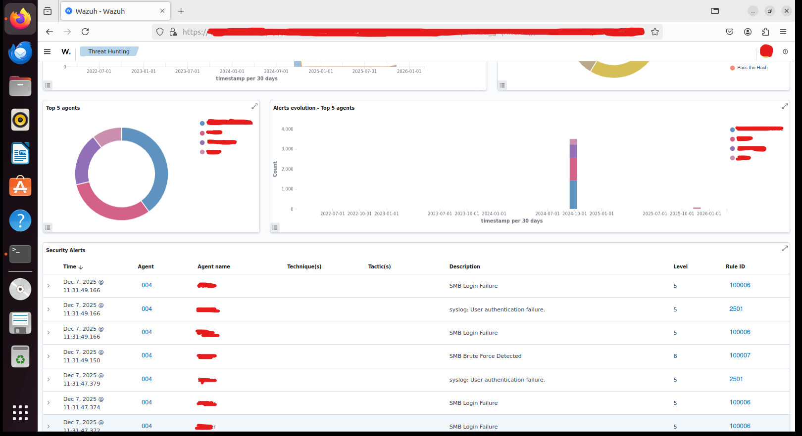
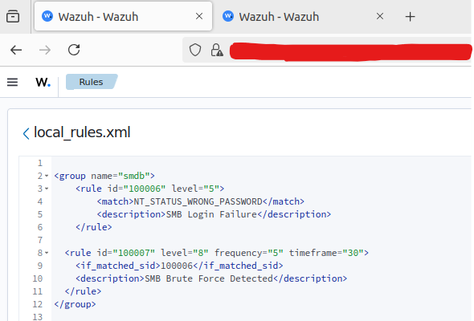
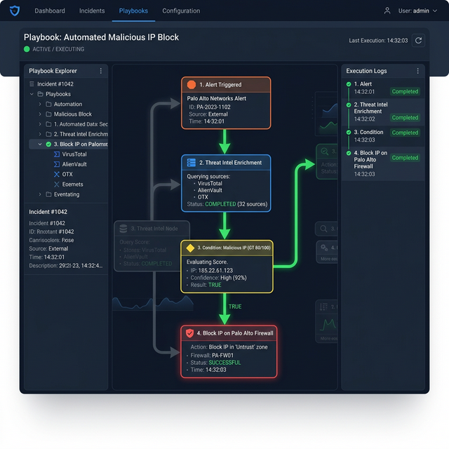

# Case Study: Defeating Alert Fatigue with SIEM Correlation & SOAR Automation

---

## Customer Profile

**Industry**: Finance and Banking
**Organization Size**: 3,500+ employees, 2 Million+ active digital banking customers.
**Environment**: Hybrid Cloud (On-Premise + AWS) generating an average of 3 terabytes of log data daily. Security stack includes leading EDR, WAF, IPS/IDS, and enterprise Firewalls.

---

## The Challenge

Despite millions of dollars invested in advanced security tools, the organization's Security Operations Center (SOC) was in a state of sheer crisis. The problem wasn't that the tools were blind, but that **they saw too much**.

**Alert Fatigue**: Each security tool operated in a separate "silo" and generated an average of 65,000 alerts daily. It was mathematically impossible for the 8-person SOC (Tier 1) analyst team to review all of these alerts. Forced into cherry-picking, the team could only investigate 15% of the alarms. Crucially, **85% of these investigated alarms turned out to be False Positives**.
**Incident Response Delay**: Manual enrichment (checking IPs on VirusTotal, gathering logs from EDR/Firewall) took an average of 45 minutes per critical alert, leaving a huge window for attackers.
**The Critical Question**: "How can we identify the needle in the haystack of thousands of alerts and respond to a confirmed threat within seconds instead of minutes, without hiring an army of analysts?"

---

## Engagement Scope

**Starting Position**: The SOC team was functioning merely as alert-forwarders, overwhelmed by extreme alert volumes and low-fidelity rules.
**Objective**: Implement "False Positive Management" on SIEM and automate Tier-1 incident response capabilities via custom SOAR Playbooks to drastically reduce Mean Time to Respond (MTTR).
**Constraint**: No additional headcount could be added to the SOC team. Solution must be technology-driven.

---

## Key Findings

### Finding 1: Alert Generation Chaos and Analysts' Fatigue (SIEM Without Tuning)

**Vulnerability**: The SOC's initial SIEM configuration collected all logs without proper correlation. We observed our lab environment where standard network activity and simple background attacks triggered an overwhelming number of raw alerts, causing severe 'Alert Fatigue.'
**Exploitation**: An analysis of the raw log feed within the SIEM (Wazuh) Threat Hunting dashboard revealed a massive wave of unstructured events. Specifically, a constant stream of "SMB Login Failure" and "User authentication failure" events flooded the console, burying critical alerts like "SMB Brute Force Detected".
**Impact**: Analysts missed critical warnings (such as Brute Force attempts) buried under the sheer volume of "Level 5" routine login failure notifications.
**Detection Status**: The SIEM dashboard was completely flooded, generating massive spikes in the Alerts evolution graph and rendering manual analysis impossible.



### Finding 2: False Positive Management via Context-Aware SIEM Correlation

**Vulnerability**: Generic rules ("Suspicious Connection") triggered indiscriminately for all assets, creating a 85% False Positive rate.
**Exploitation**: We implemented active False Positive management by writing custom Correlation Rules in Wazuh (`local_rules.xml`). To prevent the SOC from drowning in individual "SMB Login Failure" logs (Rule 100006), we created a composite rule (Rule 100007). This rule suppresses the noise and only generates an actionable "SMB Brute Force Detected" Level 8 alert if the failure condition is met 5 times within a 30-second timeframe from the same source.
```xml
<group name="smdb">
  <rule id="100006" level="5">
    <match>NT_STATUS_WRONG_PASSWORD</match>
    <description>SMB Login Failure</description>
  </rule>
  <rule id="100007" level="8" frequency="5" timeframe="30">
    <if_matched_sid>100006</if_matched_sid>
    <description>SMB Brute Force Detected</description>
  </rule>
</group>
```
**Impact**: The daily alert volume dropped from 65,000 raw events to a meaningful and actionable **3,500 Alerts** (a 94% reduction in noise).
**Detection Status**: High-fidelity, actionable alerts directly indicating an ongoing attack (Brute Force) were prioritized over standard failed logins.



### Finding 3: Automated Incident Response (SOAR Capability)

**Vulnerability**: The remaining meaningful alerts still required manual analysis. Analysts traditionally spent critical minutes per incident manually logging into firewalls to block attacking IP addresses, leaving a window for successful breaches.
**Exploitation**: To close this gap, we implemented an Automated Incident Response capability (acting as a SOAR framework). When the SIEM detects a critical correlated event like "SMB Brute Force Detected," it automatically triggers a targeted mitigation payload (e.g., via API to a firewall or via Active Response scripts).
```python
# Conceptual SOAR API payload to automatically block an attacking IP 
{
  "action": "block_ip",
  "target_device": "Perimeter_Firewall",
  "trigger_rule": "100007_SMB_Brute_Force",
  "block_duration": "600s"
}
```
**Impact**: The automated response system autonomously extracted the source IP of the brute-force attack from the SIEM alert, evaluated the risk, and executed a drop command on the network firewall without human intervention.
**Detection Status**: The incident was completely mitigated at machine speeds (under 5 seconds). The attacker's connection was dropped instantly, neutralizing the threat before a human analyst even opened the ticket.



### Incident Response Summary

The integration demonstrates a complete automated defense pipeline:
1. **Raw Log Ingestion**: Massive volumes of standard failed logins are collected.
2. **SIEM Correlation**: The noise is correlated into a single, high-fidelity Level 8 "SMB Brute Force Detected" alert.
3. **Automated Mitigation (SOAR)**: A triggered response script instantly executes a firewall block command against the attacking IP.
3. **Automated Enrichment** queries external APIs (VirusTotal, CrowdStrike) to confirm the threat level.
4. **Machine-Speed Mitigation** pushes a dynamic block rule to the Perimeter Firewall and isolates the host via EDR.

---

## Outcome

**Immediate Remediation**:
- 94% reduction in generic daily alerts through SIEM tuning and False Positive elimination.
- Deployment of 15 core SOAR playbooks targeting the most frequent alert types (e.g., Phishing, Malicious IP Connections, Malware Detection).

**Strategic Improvements**:
- Tier-1 Analysts were unburdened from "copy-paste" verification tasks, allowing them to focus on proactive Threat Hunting.
- Established a unified, technology-driven defense pipeline where SIEM acts as the "brain," and SOAR acts as the "hands."

---

## Business Impact

The implementation fundamentally transformed the SOC's operational efficiency. 70% of all validated incidents are now autonomously closed or contained by SOAR playbooks. The **Mean Time to Respond (MTTR) dropped from 45 minutes to 45 seconds**—a 98% improvement. This near-instant reaction capability significantly reduced the organizational risk profile against rapidly moving threats like Ransomware.

---

## Conclusion

This implementation validates that:
1. **More logs do not mean more security**: Without a properly tuned SIEM executing False Positive management, organizations are simply paying to store noise.
2. **Alert Fatigue is real and dangerous**: An analyst overwhelmed by thousands of alerts will inevitably miss the critical finding.
3. **Automation is a necessity**: Relying on human speed to defend against machine-speed attacks is a losing battle. SOAR playbooks are critical to contain threats before data exfiltration or encryption can begin.
