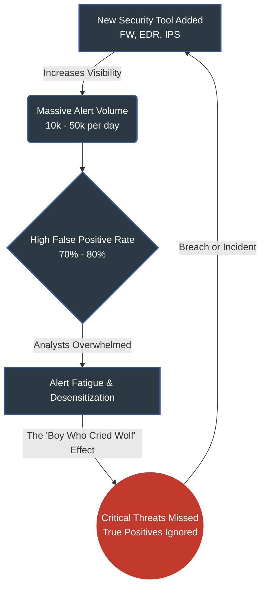
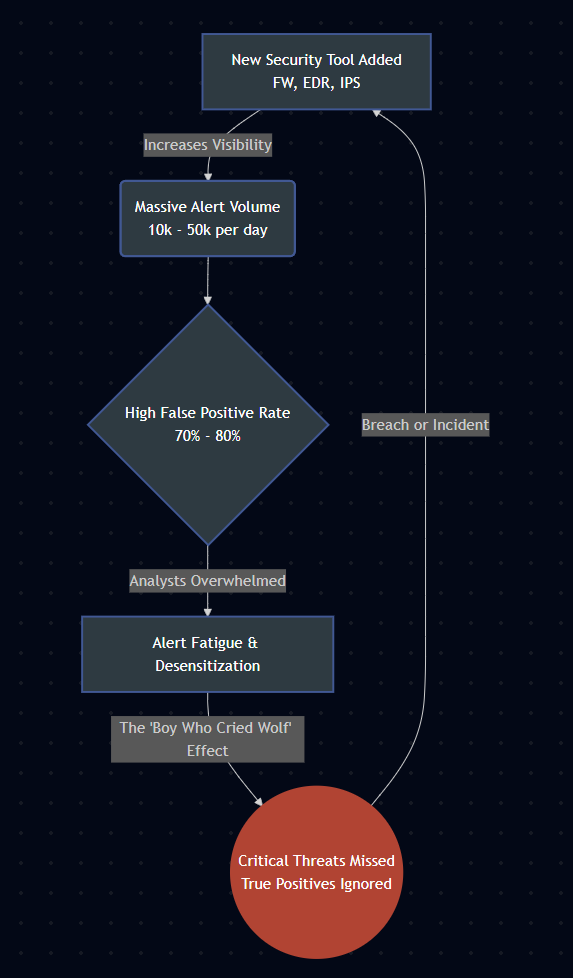
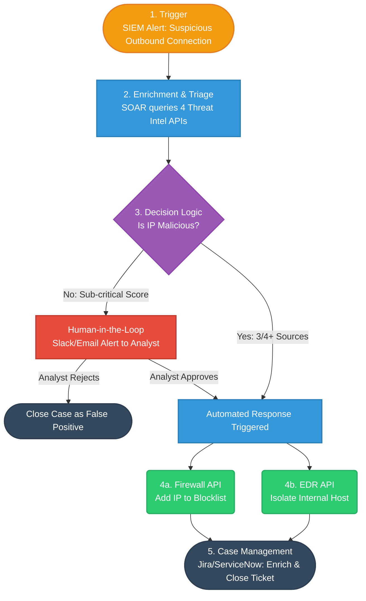
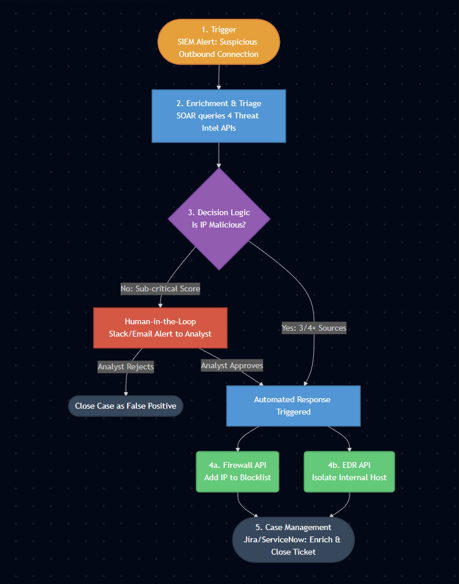

# SIEM and SOAR Platforms: Fundamentals of Security Automation

---

## Executive Summary

With the acceleration of digital transformation and the blurring of network perimeters, the cybersecurity threat surface of organizations has reached an unprecedented scale. Security Operations Centers (SOCs), tasked with protecting corporate networks, face thousands, sometimes hundreds of thousands, of security alerts daily. In a traditional setup, security analysts are expected to manually review this deluge of alerts, separate real threats from false positives, and react within seconds. However, the limits of human capacity have brought this makeshift defense line to the brink of collapse.

This situation has given rise to one of the most insidious enemies in the cybersecurity world: **"Alert Fatigue."** When analysts are constantly exposed to numerous and often trivial alarms, they face the risk of missing a "True Positive" attack alert that could be truly devastating. The problem isn't just having too much data; it's the inability to turn this data into actionable intelligence.

This is precisely where **SIEM (Security Information and Event Management)** and **SOAR (Security Orchestration, Automation, and Response)** platforms emerge as the inseparable duo of modern security architecture. SIEM acts as the organization's digital nervous system, collecting logs from every endpoint and identifying anomalies through correlation. However, SIEM alone is just a sophisticated alarm bell telling you something went wrong. The power that will serve as the "hands" to put out the fire, orchestrate processes, and shift response from human speed to machine speed is SOAR.

This whitepaper examines the core capabilities of SIEM and SOAR concepts, the synergy between them, and how automation (Playbooks) plays a vital role in increasing the efficiency of SOC teams. Based on real-world scenarios, it charts a roadmap to escape being lost in thousands of alerts, reduce Incident Response times from minutes to milliseconds, and establish a proactive line of defense.

---

## The Core Challenge: The SOC Analyst's Nightmare

### Alert Fatigue and the False Positive Problem

When a new tool is added to an organization's security infrastructure (Firewall, EDR, IDS/IPS, Proxy, WAF), the gathered visibility increases. However, each of these tools generates alarms in its own language and with its own thresholds. A mid-sized SOC receives an average of 10,000 to 50,000 alerts per day. It takes an average of 15-20 minutes for an analyst to manually analyze an alert (checking IP reputation, reviewing user activity, verifying network traffic). Mathematically, it is impossible to review all alerts with existing human resources.

A vast majority of these alerts (typically 70-80%) are **"False Positives,"** meaning they are actually harmless but get caught by algorithms as normal network behaviors. For example:
*   A system administrator initiating an RDP session for emergency maintenance outside of business hours (Abnormal Login Alert).
*   A newly installed backup software connecting to all servers simultaneously (Port Scanning/Lateral Movement Alert).

When analysts spend their entire day closing these false alarms, desensitization begins. Just like the story of the boy who cried wolf, a critical "Ransomware Data Exfiltration" alert can get lost amidst ordinary log clutter.

### The Cost of Inaction

The cost of alert fatigue and poorly managed False Positives is two-fold:
1.  **Risk Cost**: Missing actual attacks (True Positives). In many massive data breach cases like Target and Equifax, it was later revealed that security systems did detect the attack, but the alert was either overlooked by analysts or dismissed as a "False Positive."
2.  **Burnout Cost**: The exhaustion of valuable talent (Senior Analysts) due to repetitive "Copy-Paste" investigations, leading to high turnover rates in the SOC industry.

---

## SIEM vs. SOAR: The Union of Brain and Brawn

To understand security automation, it is essential to clearly distinguish the roles of SIEM and SOAR. They are not competitors, but complements.

### SIEM (Security Information and Event Management) - "The Seeing Eyes"

SIEM collects raw log data from all devices on the network (Servers, Routers, Firewalls, Antivirus, Applications) into a centralized location. It normalizes this data and establishes **Correlation** between them.

**Real-World Example (Proof of Concept):**
A Firewall alone might say: *"An SSH connection was made from IP A to Server B."*
Active Directory alone might say: *"User X entered an incorrect password 5 times."*
SIEM combines these two events and paints the bigger picture: *"User X's account was subjected to a Brute-Force attack, and immediately after a successful login, a suspicious SSH session was opened from this user to the critical database server B."*

The primary task of SIEM is **Detection**. However, its response capability is limited. It generates the alert and passes the ball to the analyst.

### SOAR (Security Orchestration, Automation, and Response) - "The Intervening Hands"

SOAR receives the alerts generated by SIEM or other security tools (EDR, Email Gateway) and responds to them **automatically or semi-automatically** via predefined workflows called Playbooks.

SOAR rests on 3 main pillars:
1.  **Orchestration**: Enables different and independent tools in the SOC (Firewalls, EDRs, Threat Intelligence platforms, IT Ticketing systems) to communicate with each other via APIs.
2.  **Automation**: Assigns repetitive, non-decision-making tasks to machines (e.g., querying an IP on VirusTotal).
3.  **Response**: Once a threat is analyzed, it takes split-second action to stop the attacker (Quarantine, Blocking, Account Lockout).

**Core Differences Table:**

| Feature | SIEM | SOAR |
| :--- | :--- | :--- |
| **Primary Function** | Log Collection, Correlation, Threat Detection, Alert Generation | Tool Integration, Automated Analysis, Incident Response |
| **Role** | Observer and Analyst | Executor and Coordinator |
| **Input** | Logs and Flow traffic from devices | Alerts from SIEM, EDR, or other tools |
| **Output** | Alert and Dashboard | Resolved Incident, Enriched Data, Action (e.g., IP Blocking) |
| **Human Dependency** | High human effort required to interpret alarms and take action. | Operates at machine speed, relies on human authority only for critical decisions (Approval). |

---

## Building the Defense: False Positive Management and Correlation Rules

For SOAR to work effectively, SIEM must produce clean and high-quality alerts. The "Garbage In, Garbage Out" rule is an absolute truth in cybersecurity. The first step to defeating Alert Fatigue is building an aggressive **False Positive Management** strategy within the SIEM.

### Rule Tuning Strategies

1.  **Whitelisting**: Preventing known and trusted behaviors on the network from generating alerts. For instance, whitelisting your Vulnerability Scanner's IP address in IPS/SIEM rules prevents weekly scans from generating thousands of fake "Exploit Attempt" alerts.
2.  **Context-Aware Thresholds**: Improving rule quality. A rule like "Alert if a user enters a wrong password 5 times" generates too many false positives on its own. Instead, making it context-aware (Correlation): *"Alert if a user enters a wrong password 10 times within 5 minutes over a VPN (from a geographically different country), and subsequently extracts more than 100 MB of data from the same device."* Such "High Fidelity" rules drastically increase the True Positive probability.
3.  **Dynamic Asset Profiling**: SIEM must know the roles of the servers. A Database server conducting HTTP traffic is suspicious, but a Web Server doing so is normal. Rules must be customized based on Asset types.

A perfectly tuned SIEM converts 10,000 raw logs per hour into 50 qualified alerts. Yet, even these 50 alerts might be too much for manual analysis. This is where SOAR and Playbooks take the stage.

---

## The Engine of Operations: Playbook Architecture

A **Playbook** is a step-by-step script or workflow translated into machine language, dictating the steps analysts must follow when a specific security incident occurs.

Playbooks are structured with *Trigger*, *Condition*, and *Action* phases, much like basic coding logic.

### Case-Based Analysis: "Automated Blocking of Malicious IP on Firewall" Playbook

In a traditional SOC, when a connection from a suspicious IP address to an external network is detected, the process looks like this (Average: 20 Minutes):
1. SIEM generates an alert.
2. Analyst copies the IP address and manually searches it on Threat Intelligence sites like VirusTotal, IBM X-Force, AlienVault OTX.
3. If the IP is malicious, the analyst logs into the organization's Firewall interface (e.g., Palo Alto, Fortinet).
4. Manually adds the IP to the "Blacklist" rule and applies the policy (Commit).
5. Logs into the Ticketing System, reports the incident, and closes it.

Instead, a **Playbook written on SOAR** completes this process in milliseconds, autonomously:

**Playbook Logic (Automated Scenario)**

*   **1. Trigger**: The *"Suspicious Outbound Connection (Suspected C2 Communication)"* alert drops from SIEM into SOAR. Source IP (Internal) and Destination IP (External) artifacts are parsed from the alert.
*   **2. Enrichment / Triage**: SOAR automatically sends the Destination IP to 4 different Threat Intelligence platforms via APIs and fetches the reputation score.
*   **3. Decision Logic**: 
    *   *If* the IP score is marked as "Malicious" in 3 out of 4 sources -> Automatically Proceed to Next Step (True Positive Confirmed).
    *   *Else* -> Send an email or a Slack/Teams message with an approval button to the analyst stating "Suspicious but not definitive, manual approval required" (Human-in-the-Loop).
*   **4. Automated Response**: Since the threat is confirmed, SOAR sends a REST API request to the central Firewall. It adds the Destination IP address to the Firewall's "Dynamic Blocklist" object.
*   **5. Containment**: Simultaneously, SOAR sends a command to the EDR API to isolate the internal computer making this connection from the network (Network Isolation).
*   **6. Case Management**: SOAR opens an automated ticket on Jira/ServiceNow. It appends all analysis results (VirusTotal score, etc.) and actions taken (Firewall blocking) to the ticket, and transitions the incident state to "Closed".

**Result**: A tedious, manual, 20-minute process prone to human error is completed in **5 seconds** with 100% accuracy, without human touch.

---

## Business Impact and Return on Investment (ROI)

The synergy of SIEM and SOAR in security operations not only bolsters the organization's cyber resilience but also directly improves financial metrics.

1.  **Dramatic Reduction in MTTD and MTTR**: Mean Time to Detect (MTTD) is slashed thanks to SIEM's correlation power, while Mean Time to Respond (MTTR) is reduced by 80-90% thanks to SOAR's split-second playbooks. In a Ransomware scenario, reducing the response time from minutes to seconds means preventing the encryption of thousands of computers.
2.  **Operational Efficiency and Scalability**: Because simple, repetitive alerts that normally consume 70% of SOC capacity are handed over to machines, existing personnel can focus on advanced activities requiring expertise, such as Threat Hunting and Malware Analysis. Even as the organization grows, the need to linearly increase headcount is eliminated because the orchestrator is SOAR.
3.  **Standardization and Zeroing Human Error**: The possibility of a panicking analyst blocking the wrong IP or skipping a procedure during a crisis is eliminated. Playbooks ensure that every incident is responded to with the same composure using standard, tested rules.

---

## Conclusion

In an era where attackers weaponize automation tools, advanced botnets, and artificial intelligence, it is impossible for defenders to survive relying solely on manual processes, static rules, and human reflexes.

SIEM platforms are the most critical layer that sheds light on the defense infrastructure's blind spots and provides the intelligence. However, the true power that transforms detection into prevention, orchestrating this process and imbuing it with autonomous reflexes, lies within SOAR platforms. A properly managed "False Positive" rate driven by high-quality SIEM rules, combined with automated "True Positive" responses executed by SOAR Playbooks, is the sole formula for organizations to break free from the Alert Fatigue spiral and ascend to "Proactive Cybersecurity." The convergence of brain and brawn (SIEM + SOAR) is not just a technology upgrade; it is an evolutionary imperative in cybersecurity.

---
