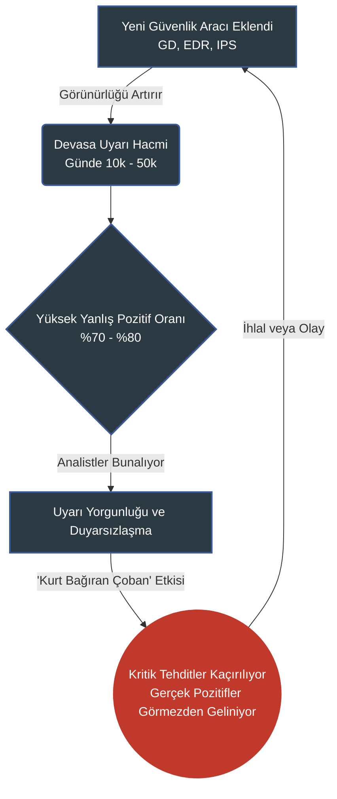
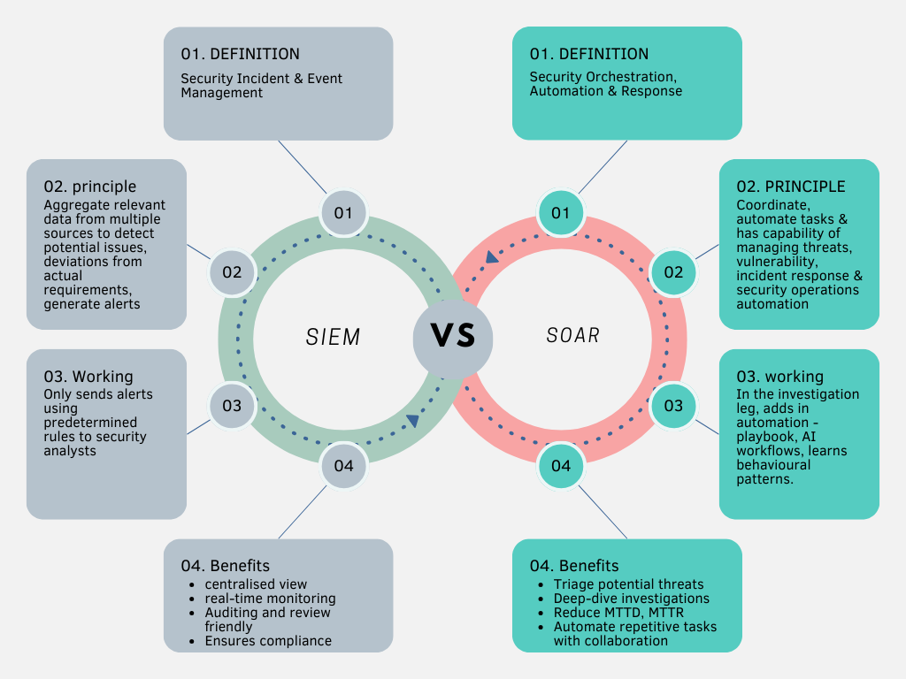
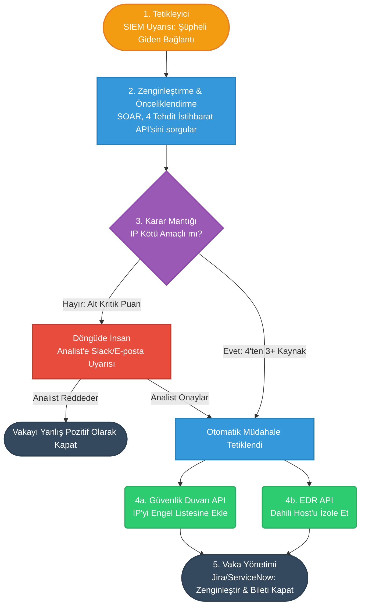

# SIEM ve SOAR Platformları: Güvenlik Otomasyonunun Temelleri

---

## Yönetici Özeti

Dijital dönüşümün hız kazanması ve ağ çevrelerinin bulanıklaşmasıyla birlikte, kuruluşların siber güvenlik tehdit yüzeyi eşi görülmemiş bir ölçeğe ulaşmıştır. Kurumsal ağları korumakla görevlendirilen Güvenlik Operasyonları Merkezleri (SOC'lar), her gün binlerce, hatta yüz binlerce güvenlik uyarısıyla yüz yüze gelmektedir. Geleneksel bir yapıda güvenlik analistlerinin bu uyarı selini manuel olarak incelemesi, gerçek tehditleri yanlış pozitiflerden ayırması ve saniyeler içinde tepki vermesi beklenmektedir. Ne var ki insan kapasitesinin sınırları, bu geçici savunma hattını çöküşün eşiğine getirmiştir.

Bu durum, siber güvenlik dünyasının en sinsi düşmanlarından birini doğurmuştur: **"Uyarı Yorgunluğu."** Analistler sürekli olarak çok sayıda ve çoğunlukla önemsiz alarmlara maruz kaldığında, gerçekten yıkıcı olabilecek bir "Gerçek Pozitif" saldırı uyarısını gözden kaçırma riskiyle karşılaşırlar. Sorun yalnızca çok fazla veriye sahip olmak değil; bu veriyi eyleme dönüştürülebilir istihbarata çevirememektir.

İşte tam burada **SIEM (Güvenlik Bilgisi ve Olay Yönetimi)** ve **SOAR (Güvenlik Orkestrasyonu, Otomasyonu ve Müdahalesi)** platformları, modern güvenlik mimarisinin ayrılmaz ikilisi olarak öne çıkmaktadır. SIEM, her uç noktadan günlükleri toplayarak ve korelasyon yoluyla anormallikleri tespit ederek kuruluşun dijital sinir sistemi işlevi görür. Ancak SIEM tek başına, yalnızca bir şeylerin yanlış gittiğini bildiren gelişmiş bir alarm zilidir. Yangını söndürecek "eller" işlevi görecek, süreçleri orkestre edecek ve müdahaleyi insan hızından makine hızına taşıyacak güç SOAR'ın içinde yatmaktadır.

Bu teknik rapor; SIEM ve SOAR kavramlarının temel yeteneklerini, aralarındaki sinerjisi ve otomasyonun (Playbook'lar) SOC ekiplerinin verimliliğini artırmada oynadığı kritik rolü incelemektedir. Gerçek dünya senaryolarından hareketle, binlerce uyarı arasında kaybolmaktan kurtulmak, Olay Müdahale sürelerini dakikalardan milisaniyelere indirmek ve proaktif bir savunma hattı oluşturmak için bir yol haritası çizmektedir.

---

## Temel Sorun: SOC Analistinin Kabusu

### Uyarı Yorgunluğu ve Yanlış Pozitif Sorunu

Bir kuruluşun güvenlik altyapısına yeni bir araç eklendiğinde (Güvenlik Duvarı, EDR, IDS/IPS, Proxy, WAF), elde edilen görünürlük artar. Ancak bu araçların her biri kendi dilinde ve kendi eşikleriyle alarm üretir. Orta ölçekli bir SOC, günde ortalama 10.000 ile 50.000 arasında uyarı alır. Bir analistin bir uyarıyı manuel olarak analiz etmesi (IP itibarını kontrol etmek, kullanıcı aktivitesini gözden geçirmek, ağ trafiğini doğrulamak) ortalama 15-20 dakika alır. Matematiksel olarak mevcut insan kaynaklarıyla tüm uyarıları incelemek imkânsızdır.

Bu uyarıların büyük çoğunluğu (%70-80) **"Yanlış Pozitif"**tir; yani aslında zararsız olmakla birlikte algoritmalar tarafından anormal olarak işaretlenen normal ağ davranışlarıdır. Örneğin:
*   Mesai saatleri dışında acil bakım için RDP oturumu başlatan bir sistem yöneticisi (Anormal Giriş Uyarısı).
*   Yeni yüklenen bir yedekleme yazılımının tüm sunuculara aynı anda bağlanması (Port Tarama/Yanal Hareket Uyarısı).

Analistler günlerini bu yanlış alarmları kapatarak geçirdiğinde, duyarsızlaşma başlar. Tıpkı kurt var diye bağıran çoban hikâyesinde olduğu gibi, kritik bir "Fidye Yazılımı Veri Sızıntısı" uyarısı sıradan günlük kirliliği arasında kaybolabilir.

### Hareketsizliğin Bedeli

Uyarı yorgunluğunun ve kötü yönetilen Yanlış Pozitiflerin maliyeti iki boyutludur:
1.  **Risk Maliyeti**: Gerçek saldırıların (Gerçek Pozitifler) gözden kaçırılması. Target ve Equifax gibi pek çok büyük veri ihlali vakasında sonradan ortaya çıktı ki güvenlik sistemleri saldırıyı gerçekten tespit etmişti; ancak uyarı ya analistler tarafından görmezden gelindi ya da "Yanlış Pozitif" olarak reddedildi.
2.  **Tükenmişlik Maliyeti**: Değerli yeteneklerin (Kıdemli Analistler) tekrarlayan "Kopyala-Yapıştır" soruşturmalarından dolayı tükenmesi ve SOC sektöründe yüksek çalışan devir hızına yol açması.

---

## SIEM ve SOAR: Beyin ile Beden Birlikteliği

Güvenlik otomasyonunu anlamak için SIEM ve SOAR'ın rollerini net biçimde birbirinden ayırt etmek şarttır. Bunlar rakip değil, tamamlayıcıdır.

### SIEM (Güvenlik Bilgisi ve Olay Yönetimi) — "Gören Gözler"

SIEM, ağdaki tüm cihazlardan (Sunucular, Yönlendiriciler, Güvenlik Duvarları, Antivirüs, Uygulamalar) ham günlük verilerini merkezi bir konuma toplar. Bu verileri normalleştirir ve aralarında **Korelasyon** kurar.

**Gerçek Dünya Örneği (Kavram Kanıtı):**
Bir Güvenlik Duvarı tek başına şunu söyleyebilir: *"A IP'sinden B Sunucusuna SSH bağlantısı kuruldu."*
Active Directory tek başına şunu söyleyebilir: *"X kullanıcısı şifreyi 5 kez yanlış girdi."*
SIEM bu iki olayı bir araya getirerek büyük resmi çizer: *"X kullanıcısının hesabına Kaba Kuvvet saldırısı düzenlendi ve başarılı girişin hemen ardından bu kullanıcıdan kritik B veritabanı sunucusuna şüpheli bir SSH oturumu açıldı."*

SIEM'in birincil görevi **Tespittir**. Ancak müdahale kapasitesi sınırlıdır; uyarıyı oluşturur ve topu analistin sahasına atar.

### SOAR (Güvenlik Orkestrasyonu, Otomasyonu ve Müdahalesi) — "Müdahale Eden Eller"

SOAR, SIEM veya diğer güvenlik araçları (EDR, E-posta Geçidi) tarafından üretilen uyarıları alır ve Playbook adı verilen önceden tanımlanmış iş akışları aracılığıyla **otomatik ya da yarı otomatik** biçimde yanıt verir.

SOAR 3 temel direk üzerine kurulur:
1.  **Orkestrasyon**: SOC'taki farklı ve bağımsız araçların (Güvenlik Duvarları, EDR'lar, Tehdit İstihbarat platformları, BT Bilet sistemleri) API'ler aracılığıyla birbirleriyle iletişim kurmasını sağlar.
2.  **Otomasyon**: Tekrarlayan, karar gerektirmeyen görevleri makinelere devreder (örn. bir IP'yi VirusTotal'da sorgulamak).
3.  **Müdahale**: Bir tehdit analiz edildikten sonra saldırganı durdurmak için anlık harekete geçer (Karantina, Engelleme, Hesap Kilitleme).

**Temel Farklar Tablosu:**

| Özellik | SIEM | SOAR |
| :--- | :--- | :--- |
| **Birincil İşlev** | Günlük Toplama, Korelasyon, Tehdit Tespiti, Uyarı Üretimi | Araç Entegrasyonu, Otomatik Analiz, Olay Müdahalesi |
| **Rol** | Gözlemci ve Analist | Uygulayıcı ve Koordinatör |
| **Girdi** | Cihazlardan gelen Günlükler ve Akış trafiği | SIEM, EDR veya diğer araçlardan gelen Uyarılar |
| **Çıktı** | Uyarı ve Pano | Çözümlenen Olay, Zenginleştirilmiş Veri, Eylem (örn. IP Engelleme) |
| **İnsan Bağımlılığı** | Alarmları yorumlamak ve harekete geçmek için yüksek insan çabası gerektirir. | Makine hızında çalışır; yalnızca kritik kararlar (Onay) için insan otoritesine güvenir. |

---

## Savunmayı İnşa Etmek: Yanlış Pozitif Yönetimi ve Korelasyon Kuralları

SOAR'ın etkin çalışabilmesi için SIEM'in temiz ve yüksek kaliteli uyarılar üretmesi gerekir. "Çöp girerse çöp çıkar" kuralı, siber güvenlikte mutlak bir gerçektir. Uyarı Yorgunluğunu yenmenin ilk adımı, SIEM içinde agresif bir **Yanlış Pozitif Yönetimi** stratejisi oluşturmaktır.

### Kural Ayarlama Stratejileri

1.  **Beyaz Listeye Alma**: Ağdaki bilinen ve güvenilir davranışların uyarı üretmesini engelleme. Örneğin, Güvenlik Açığı Tarayıcısının IP adresini IPS/SIEM kurallarında beyaz listeye eklemek, haftalık taramaların binlerce sahte "Saldırı Girişimi" uyarısı üretmesini önler.
2.  **Bağlam Duyarlı Eşikler**: Kural kalitesini iyileştirme. "Kullanıcı şifreyi 5 kez yanlış girerse uyar" gibi bir kural tek başına çok fazla yanlış pozitif üretir. Bunun yerine bağlam duyarlı (Korelasyon) hale getirmek: *"Kullanıcı, VPN üzerinden (coğrafi olarak farklı bir ülkeden) 5 dakika içinde 10 kez şifreyi yanlış girerse ve ardından aynı cihazdan 100 MB'ın üzerinde veri çıkartırsa uyar."* Bu tür "Yüksek Güvenilirlikli" kurallar, Gerçek Pozitif olasılığını önemli ölçüde artırır.
3.  **Dinamik Varlık Profilleme**: SIEM, sunucuların rollerini bilmelidir. HTTP trafiği yapan bir Veritabanı sunucusu şüphelidir; ancak bunu yapan bir Web Sunucusu normaldir. Kurallar, Varlık türlerine göre özelleştirilmelidir.

İyi ayarlanmış bir SIEM, saatte 10.000 ham günlüğü 50 nitelikli uyarıya dönüştürür. Yine de bu 50 uyarı, manuel analiz için çok fazla olabilir. İşte bu noktada SOAR ve Playbook'lar devreye girer.

---

## Operasyonların Motoru: Playbook Mimarisi

Bir **Playbook**, belirli bir güvenlik olayı meydana geldiğinde analistlerin izlemesi gereken adımları makine diline çevrilmiş, adım adım bir senaryo veya iş akışıdır.

Playbook'lar, temel kodlama mantığı gibi *Tetikleyici*, *Koşul* ve *Eylem* aşamalarıyla yapılandırılır.

### Vakaya Dayalı Analiz: "Güvenlik Duvarında Kötü Amaçlı IP'nin Otomatik Engellenmesi" Playbook'u

Geleneksel bir SOC'ta, şüpheli bir IP adresinden dış ağa bağlantı tespit edildiğinde süreç şöyle işler (Ortalama: 20 Dakika):
1. SIEM bir uyarı oluşturur.
2. Analist IP adresini kopyalar ve VirusTotal, IBM X-Force, AlienVault OTX gibi Tehdit İstihbarat sitelerinde manuel olarak arar.
3. IP kötü amaçlıysa analist, kuruluşun Güvenlik Duvarı arayüzüne giriş yapar (örn. Palo Alto, Fortinet).
4. IP'yi manuel olarak "Kara Liste" kuralına ekler ve politikayı uygular (Commit).
5. Bilet Sistemine giriş yapar, olayı raporlar ve kapatır.

Bunun yerine, **SOAR üzerinde yazılmış bir Playbook** bu süreci milisaniyeler içinde, özerk biçimde tamamlar:

**Playbook Mantığı (Otomatik Senaryo)**

*   **1. Tetikleyici**: SIEM'den *"Şüpheli Giden Bağlantı (Şüpheli C2 İletişimi)"* uyarısı SOAR'a düşer. Kaynak IP (Dahili) ve Hedef IP (Harici) eserleri uyarıdan ayrıştırılır.
*   **2. Zenginleştirme / Önceliklendirme**: SOAR, API'ler aracılığıyla Hedef IP'yi otomatik olarak 4 farklı Tehdit İstihbarat platformuna gönderir ve itibar puanını alır.
*   **3. Karar Mantığı**: 
    *   *Eğer* IP puanı 4 kaynaktan 3'ünde "Kötü Amaçlı" olarak işaretlendiyse -> Otomatik Olarak Sonraki Adıma Geç (Gerçek Pozitif Doğrulandı).
    *   *Aksi takdirde* -> Analistin cihazına "Şüpheli ama kesin değil, manuel onay gerekiyor" yazısıyla onay düğmesi içeren bir e-posta veya Slack/Teams mesajı gönder (Döngüde İnsan).
*   **4. Otomatik Müdahale**: Tehdit doğrulandığından SOAR, merkezi Güvenlik Duvarına bir REST API isteği gönderir. Hedef IP adresini Güvenlik Duvarının "Dinamik Engel Listesi" nesnesine ekler.
*   **5. Kontrol Altına Alma**: SOAR aynı anda EDR API'sine bu bağlantıyı yapan dahili bilgisayarı ağdan izole etmesi için komut gönderir (Ağ İzolasyonu).
*   **6. Vaka Yönetimi**: SOAR, Jira/ServiceNow üzerinde otomatik bir bilet açar. Tüm analiz sonuçlarını (VirusTotal puanı vb.) ve alınan eylemleri (Güvenlik Duvarı engelleme) bilete ekler ve olayın durumunu "Kapalı"ya geçirir.

**Sonuç**: İnsan hatasına açık, sıkıcı ve manuel 20 dakikalık süreç, insan dokunuşu olmadan %100 doğrulukla **5 saniyede** tamamlanır.

---

## İş Etkisi ve Yatırım Getirisi (ROI)

SIEM ve SOAR'ın güvenlik operasyonlarındaki sinerjisi, yalnızca kuruluşun siber dayanıklılığını güçlendirmekle kalmaz, aynı zamanda finansal göstergeleri de doğrudan iyileştirir.

1.  **MTTD ve MTTR'de Çarpıcı Azalma**: SIEM'in korelasyon gücü sayesinde Ortalama Tespit Süresi (MTTD) kısalırken, SOAR'ın anlık playbook'ları sayesinde Ortalama Müdahale Süresi (MTTR) %80-90 oranında düşer. Fidye Yazılımı senaryosunda müdahale süresini dakikalardan saniyelere indirmek, binlerce bilgisayarın şifrelenmesinin önüne geçmek anlamına gelir.
2.  **Operasyonel Verimlilik ve Ölçeklenebilirlik**: SOC kapasitesinin %70'ini tüketen basit ve tekrarlayan uyarılar makinelere devredildiğinden, mevcut personel Tehdit Avı ve Zararlı Yazılım Analizi gibi uzmanlık gerektiren ileri düzey faaliyetlere odaklanabilir. Kuruluş büyüdükçe personeli orantılı biçimde artırma ihtiyacı ortadan kalkar; çünkü orkestratör SOAR'dır.
3.  **Standartlaştırma ve İnsan Hatasını Sıfırlama**: Panik halindeki bir analistin kriz sırasında yanlış IP'yi engellemesi ya da bir prosedürü atlama ihtimali ortadan kalkar. Playbook'lar, her olayın aynı sakinlikle, standart ve test edilmiş kurallarla yanıtlanmasını güvence altına alır.

---

## Sonuç

Saldırganların otomasyon araçlarını, gelişmiş botnet'leri ve yapay zekayı silah olarak kullandığı bir çağda, savunucuların yalnızca manuel süreçlere, statik kurallara ve insan reflekslerine dayanarak hayatta kalması imkânsızdır.

SIEM platformları, savunma altyapısının kör noktalarını aydınlatan ve istihbaratı sağlayan en kritik katmandır. Ancak tespiti önlemeye dönüştüren, bu süreci orkestre eden ve ona özerk refleksler kazandıran gerçek güç, SOAR platformlarının içinde yatmaktadır. Yüksek kaliteli SIEM kurallarının yönlendirdiği iyi yönetilmiş bir "Yanlış Pozitif" oranı ve SOAR Playbook'larının yürüttüğü otomatik "Gerçek Pozitif" yanıtlar birleştiğinde, kuruluşların Uyarı Yorgunluğu sarmalından kurtulup "Proaktif Siber Güvenlik" düzeyine yükselmesinin tek formülü ortaya çıkar. Beyin ile bedenin (SIEM + SOAR) buluşması, yalnızca bir teknoloji yükseltmesi değil; siber güvenlikteki evrimsel bir zorunluluktur.

---
